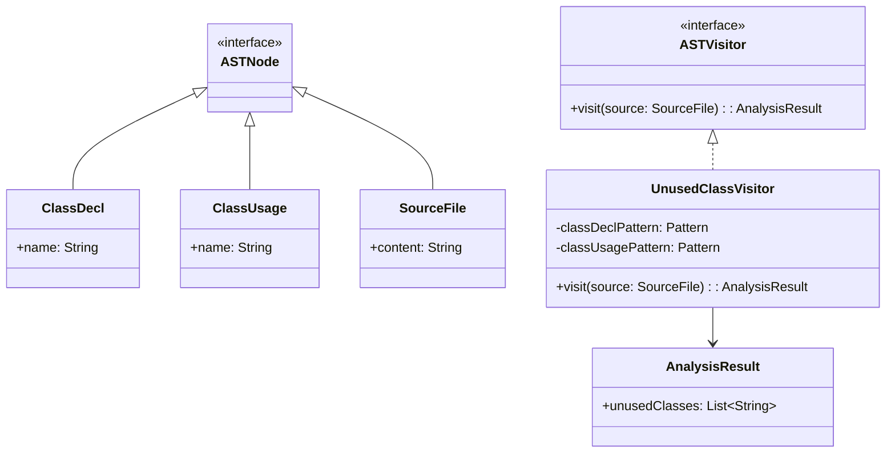

# **Unused Class Detector**

## Overview

This project detects unused Java classes in source files. The program reads the file, analyzes class declarations and usages, and prints unused classes to the console using the Visitor Pattern for AST traversal.

---

## Tech Stack

- **Java 25** → Modern Java with pattern matching features.
- **Gradle** → Build tool.
- **JDK 25** → Required to run the application.

---

## Architecture Diagram



---

## Setup Instructions

### 1 - Clone the Repository

```bash
git clone https://github.com/rbleggi/tech-pocs.git
cd java/unused-class-detector
```

### 2 - Compile & Run the Application

```bash
./gradlew build run
```

### 3 - Run Tests

```bash
./gradlew test
```
