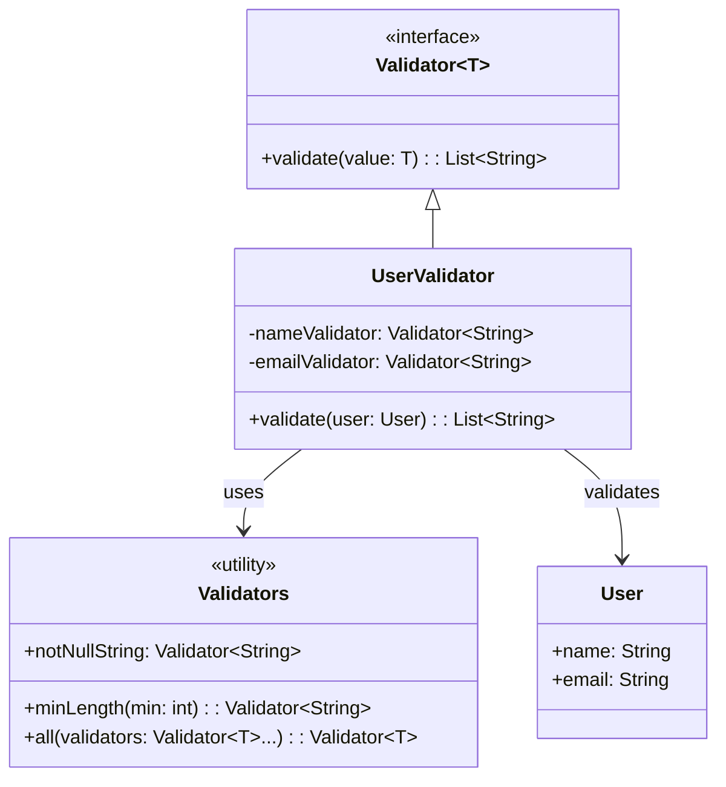

# Validation Framework

## Overview

This project implements a **composable validation framework** using **functional interfaces** without annotations. The system follows the **Strategy Pattern**, enabling **reusable validation rules** that can be combined and applied to complex objects through **pure functional composition**.

## Tech Stack

- **Java 21** → Modern Java with records and functional interfaces
- **Gradle** → Build tool
- **JUnit 5** → Testing framework

## Features

- **Annotation-Free Validation** → Pure functional approach without reflection
- **Composable Validators** → Combine validators using `all()` method
- **Type-Safe Rules** → Compile-time validation of rule types
- **Reusable Logic** → Define validators once, use everywhere
- **Clear Error Messages** → Structured error reporting per field

## Architecture



## Strategy Pattern

The **Strategy Pattern** is used to **encapsulate validation algorithms** as interchangeable strategies. This implementation:
- **Uses `Validator<T>` as a functional interface** defining the validation contract
- **Implements specific validators** for different validation rules (notNull, minLength, etc.)
- **Combines validators using `all()`**, enabling composition of multiple strategies
- **Delegates validation responsibility to each validator**, ensuring **encapsulation**

## Setup Instructions

### 1 - Clone the Repository
```bash
git clone https://github.com/rbleggi/tech-pocs.git
cd java/validation-framework
```

### 2 - Build & Run the Application
```bash
./gradlew build
./gradlew run
```

### 3 - Run Tests
```bash
./gradlew test
```
