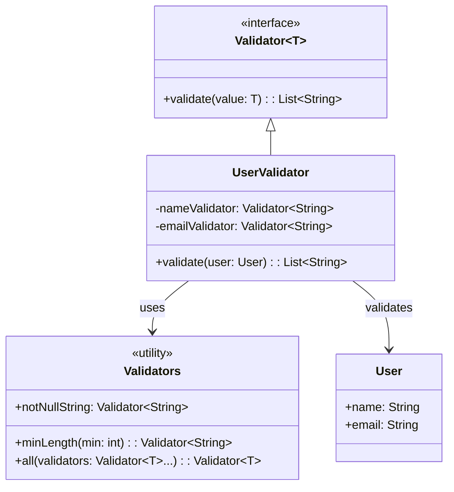

# **Validation Framework**

## Overview

This project implements a composable validation framework using functional interfaces without annotations. The system follows the Strategy Pattern, enabling reusable validation rules that can be combined and applied to complex objects through pure functional composition.

---

## Tech Stack

- **Java 25** → Modern Java with records and functional interfaces.
- **Gradle** → Build tool.
- **JDK 25** → Required to run the application.

---

## Architecture Diagram



---

## Setup Instructions

### 1 - Clone the Repository
```bash
git clone https://github.com/rbleggi/tech-pocs.git
cd java/validation-framework
```

### 2 - Compile & Run the Application
```bash
./gradlew build run
```

### 3 - Run Tests
```bash
./gradlew test
```
