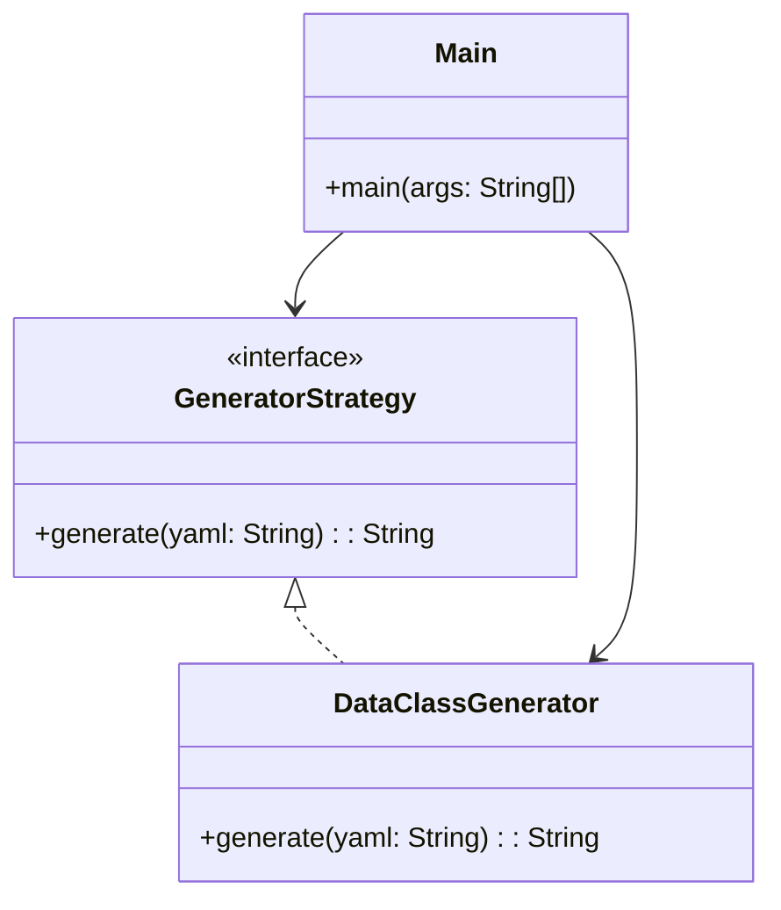

# YAML Code Generator

## Overview

A **code generation framework** that converts YAML definitions into data class code. It uses the **Strategy Pattern** to enable flexible code generation strategies, making it easy to extend for different target languages or code styles.

---

## Tech Stack

- **Java 21** → Modern Java with enhanced language features.
- **Gradle** → Build tool with support for Java projects.

---

## Architecture Diagram



---

## Setup Instructions

### 1 - Clone the Repository

```bash
git clone https://github.com/rbleggi/tech-pocs.git
cd java/yaml-code-generator
```

### 2 - Compile & Run the Application

```shell
./gradlew run
```

### 3 - Build JAR

```shell
./gradlew jar
```

### 4 - Run Tests

```shell
./gradlew test
```
