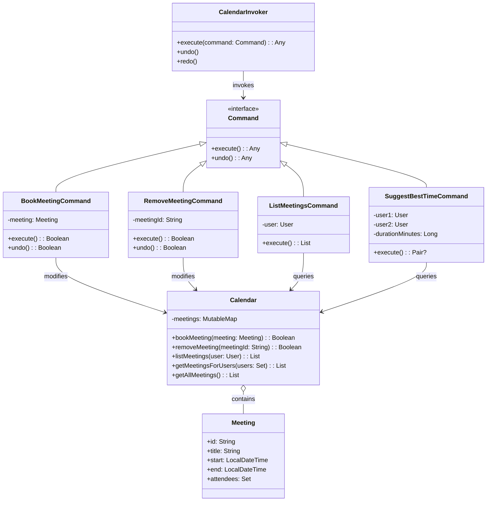

# **Calendar System (Kotlin)**

## Overview

This project implements a flexible and maintainable calendar system in Kotlin. Users can book meetings, remove meetings, list meetings, and suggest the best time for two people to meet. The system also supports undo and redo functionality for all actions.

---

## Tech Stack

- **Kotlin** → Modern JVM-based language with concise syntax and strong type safety.
- **Gradle** → Kotlin's build tool for JVM projects.
- **JDK 25** → Required to run the application.

---

## Architecture Diagram



---

## Setup Instructions

### 1 - Clone the Repository

```bash
git clone https://github.com/rbleggi/tech-pocs.git
cd kotlin/calendar
```

### 2 - Compile & Run the Application

```bash
./gradlew build run
```

### 3 - Run Tests

```bash
./gradlew test
```
