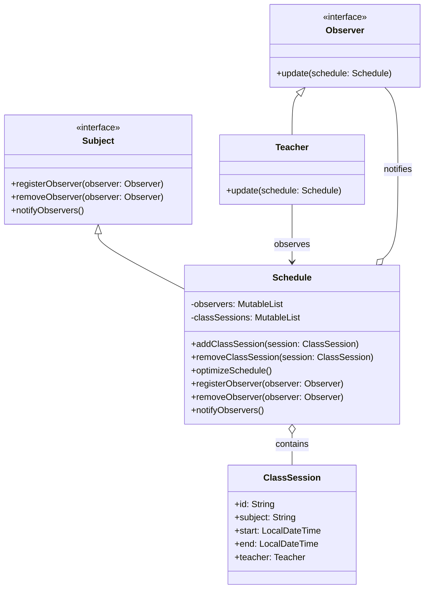

# **Teacher's Class Organizer/Optimizer (Kotlin)**

## **Overview**

This project implements a **flexible and maintainable class organizer/optimizer** for teachers using the **Observer Pattern** in **Kotlin**. Teachers and admins are notified of schedule changes, and the system helps optimize class allocations.

---

## **Tech Stack**

- **Kotlin** → Modern JVM-based language with concise syntax and strong type safety.
- **Gradle** → Kotlin's build tool for JVM projects.
- **JDK 21** → Required to run the application.

---

## **Features**

- **Class Management** → Add, remove, and optimize class sessions for teachers.
- **Observer Pattern** → Teachers/admins are notified of schedule changes automatically.
- **Conflict Detection** → Prevents scheduling overlapping classes for teachers.
- **Schedule Optimization** → Suggests optimal class allocations based on teacher availability.
- **Extensible Notification System** → Easily add new observer types (e.g., admin, parent).

---

## **Architecture Diagram**



---

## **Observer Pattern**

The **Observer Pattern** enables automatic notification of changes:

- Observers (e.g., teachers, admins) subscribe to the schedule.
- When the schedule changes, all observers are notified.
- Observers can react to changes (e.g., update their own view, send alerts).
- Easy to extend with new observer types.

---

## **Setup Instructions**

### **1️ - Clone the Repository**

```shell
git clone https://github.com/rbleggi/tech-pocs.git
cd kotlin/class-organizer
```

### **2️ - Compile & Run the Application**

```shell
./gradlew build
./gradlew run
```

### **3️ - Run Tests**

```shell
./gradlew test
```
