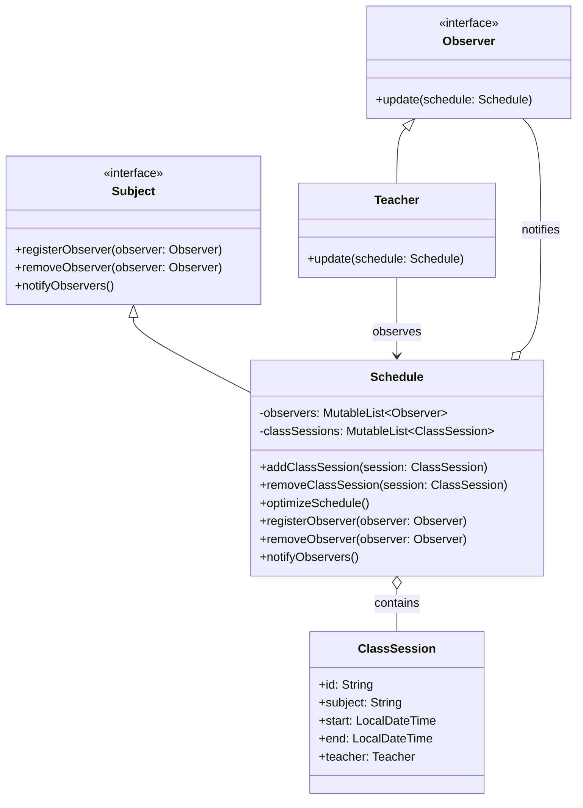

# **Class Organizer**

## Overview

Class organizer demonstrating the **Observer Pattern** for managing teacher schedules with conflict detection, automatic notifications on schedule changes, and schedule optimization.

---

## Tech Stack

- **Kotlin 2.2.20** → Modern JVM language with concise syntax and null safety.
- **Gradle** → Build automation tool with Kotlin DSL support.
- **JDK 25** → Required to run the application.
- **kotlin.test** → Testing framework.

---

## Architecture Diagram


```mermaid
classDiagram
    direction TB

    class Observer {
        <<interface>>
        +update(schedule: Schedule)
    }

    class Teacher {
        +update(schedule: Schedule)
    }

    class Subject {
        <<interface>>
        +registerObserver(observer: Observer)
        +removeObserver(observer: Observer)
        +notifyObservers()
    }

    class Schedule {
        -observers: MutableList~Observer~
        -classSessions: MutableList~ClassSession~
        +addClassSession(session: ClassSession)
        +removeClassSession(session: ClassSession)
        +optimizeSchedule()
        +registerObserver(observer: Observer)
        +removeObserver(observer: Observer)
        +notifyObservers()
    }

    class ClassSession {
        +id: String
        +subject: String
        +start: LocalDateTime
        +end: LocalDateTime
        +teacher: Teacher
    }

    Observer <|-- Teacher
    Subject <|-- Schedule
    Schedule o-- ClassSession: contains
    Schedule o-- Observer: notifies
    Teacher --> Schedule: observes
```

---

## Setup Instructions

### 1 - Clone the Repository
```bash
git clone https://github.com/rbleggi/tech-pocs.git
cd kotlin/class-organizer
```

### 2 - Build the Project
```bash
./gradlew build
```

### 3 - Run Tests
```bash
./gradlew test
```
