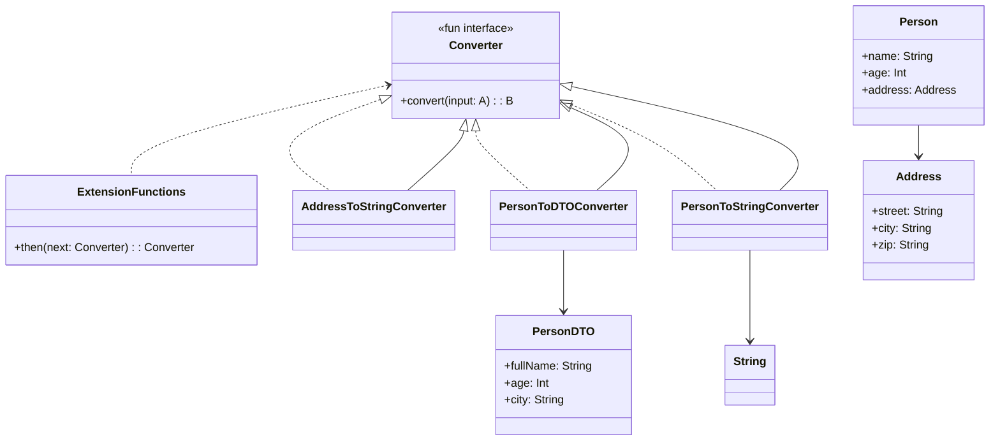

# **Converter Framework (Kotlin)**

## **Overview**

A **type-safe, composable framework** for converting between complex types in Kotlin. It enables you to define, compose, and reuse generic converters for any types, following the Adapter Pattern.

---

## **Tech Stack**

- **Kotlin** → Modern JVM-based language with advanced type safety and functional programming features.
- **Gradle** → Build tool with Kotlin DSL support.
- **JDK 24** → Required to run the application.

---

## **Features**

- **Generic Converters** → Define converters between any types using functional interfaces
- **Composable** → Easily compose and chain converters using the `then` operator
- **Type-Safe** → Compile-time safety for conversions
- **Functional** → Uses Kotlin's functional interface feature for clean syntax
- **Example Usage** → Includes real-world case class and DTO conversion examples

---

## **Architecture Diagram**



---

## **Adapter Pattern**

The **Adapter Pattern** is implemented through the `Converter` functional interface, which encapsulates type transformations. Each conversion is defined as a converter object, allowing flexible and reusable type transformations.

Key benefits:
- **Separation of Concerns**: Conversion logic is isolated from domain models
- **Reusability**: Converters can be reused across different parts of the application
- **Composability**: Converters can be chained using the `then` operator
- **Type Safety**: Compile-time type checking ensures correct conversions

---

## **Usage Examples**

### Basic Conversion
```kotlin
val address = Address("123 Main St", "Springfield", "12345")
val addressString = addressToString.convert(address)
// Output: "123 Main St, Springfield, 12345"
```

### Converter Composition
```kotlin
val personToDTOThenToString = personToDTO then Converter { dto ->
    "DTO[fullName=${dto.fullName}, age=${dto.age}, city=${dto.city}]"
}

val result = personToDTOThenToString.convert(person)
```

### Custom Converter
```kotlin
val customConverter: Converter<Int, String> = Converter { value ->
    "The number is: $value"
}
```

---

## **Setup Instructions**

### **1️ - Clone the Repository**

```bash
git clone https://github.com/rbleggi/tech-pocs.git
cd kotlin/converter-framework
```

### **2️ - Compile & Run the Application**

```shell
./gradlew run
```

### **3️ - Build JAR**

```shell
./gradlew jar
```

### **4️ - Run Tests**

```shell
./gradlew test
```

---

## **Implementation Details**

### Converter Interface
The `Converter` is defined as a functional interface (SAM - Single Abstract Method):
```kotlin
fun interface Converter<A, B> {
    fun convert(input: A): B
}
```

### Composition Operator
The `then` infix function allows elegant converter composition:
```kotlin
infix fun <A, B, C> Converter<A, B>.then(next: Converter<B, C>): Converter<A, C>
```

This enables readable chains like:
```kotlin
val composed = converter1 then converter2 then converter3
```

---

## **Project Structure**

```
converter-framework/
├── src/
│   ├── main/kotlin/com/rbleggi/converterframework/
│   │   └── Main.kt           # Core converter interface and examples
│   └── test/kotlin/com/rbleggi/converterframework/
│       └── ConverterTest.kt  # Comprehensive test suite
├── build.gradle.kts          # Build configuration
└── README.md                 # This file
```
