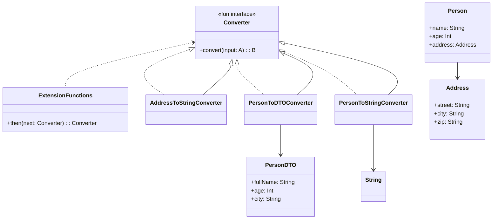

# **Converter Framework (Kotlin)**

## Overview

A type-safe, composable framework for converting between complex types in Kotlin. It enables you to define, compose, and reuse generic converters for any types.

---

## Tech Stack

- **Kotlin** → Modern JVM-based language with advanced type safety and functional programming features.
- **Gradle** → Build tool with Kotlin DSL support.
- **JDK 25** → Required to run the application.

---

## Architecture Diagram



---

## Setup Instructions

### 1 - Clone the Repository

```bash
git clone https://github.com/rbleggi/tech-pocs.git
cd kotlin/converter-framework
```

### 2 - Compile & Run the Application

```bash
./gradlew build run
```

### 3 - Run Tests

```bash
./gradlew test
```
