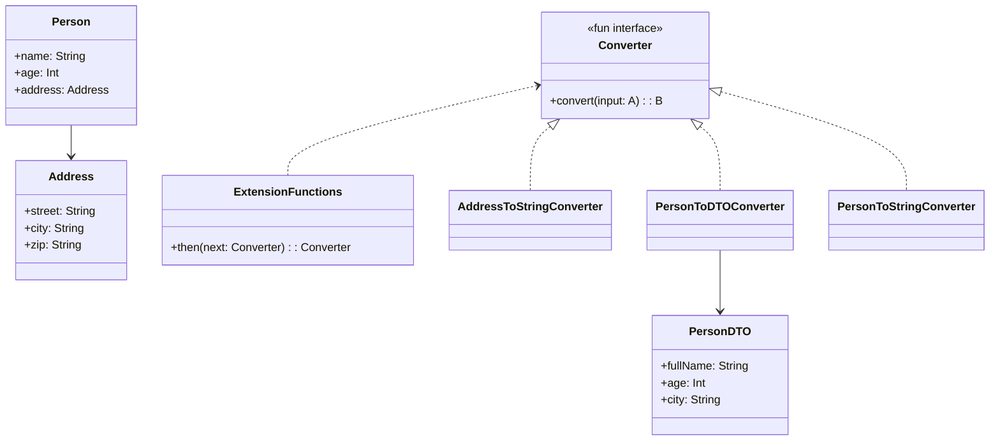

# **Converter Framework**

## Overview

Type-safe converter framework demonstrating **Functional Interfaces** and composition for converting between complex types, with pluggable and chainable converters using the `then` infix operator.

---

## Tech Stack

- **Kotlin 2.2.20** → Modern JVM language with concise syntax and null safety.
- **Gradle** → Build automation tool with Kotlin DSL support.
- **JDK 25** → Required to run the application.
- **kotlin.test** → Testing framework.

---

## Architecture Diagram


```mermaid
classDiagram
    direction TB

    class Converter {
        <<fun interface>>
        +convert(input: A): B
    }

    class ExtensionFunctions {
        +then(next: Converter): Converter
    }

    class Address {
        +street: String
        +city: String
        +zip: String
    }

    class Person {
        +name: String
        +age: Int
        +address: Address
    }

    class PersonDTO {
        +fullName: String
        +age: Int
        +city: String
    }

    Converter <.. ExtensionFunctions
    Converter <|.. AddressToStringConverter
    Converter <|.. PersonToDTOConverter
    Converter <|.. PersonToStringConverter
    Person --> Address
    PersonToDTOConverter --> PersonDTO
```

---

## Setup Instructions

### 1 - Clone the Repository
```bash
git clone https://github.com/rbleggi/tech-pocs.git
cd kotlin/converter-framework
```

### 2 - Compile & Run the Application
```bash
./gradlew run
```

### 3 - Run Tests
```bash
./gradlew test
```
