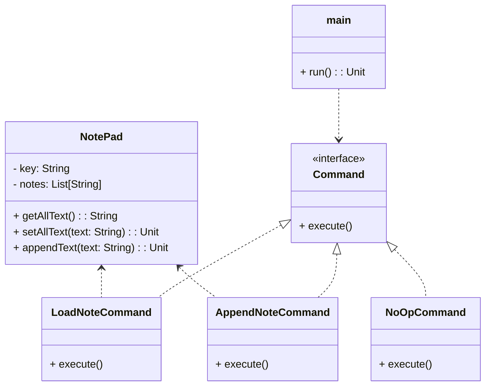

# **DontPad Command App (Kotlin)**

## Overview

A minimal local clone of dontpad.com. Each URL (e.g., `/mypage`) represents a separate document. When you open a document, all its text is loaded and shown for copying/editing. Any new text you enter is appended after the existing content.

---

## Tech Stack

- **Kotlin** → Modern JVM-based language.
- **Gradle** → Build tool.
- **JDK 25** → Required to run the application.

---

## Architecture Diagram



---

## Setup Instructions

### 1 - Clone the Repository

```bash
git clone https://github.com/rbleggi/tech-pocs.git
cd kotlin/dont-pad
```

### 2 - Compile & Run the Application

```bash
./gradlew build run
```

### 3 - Run Tests

```bash
./gradlew test
```
