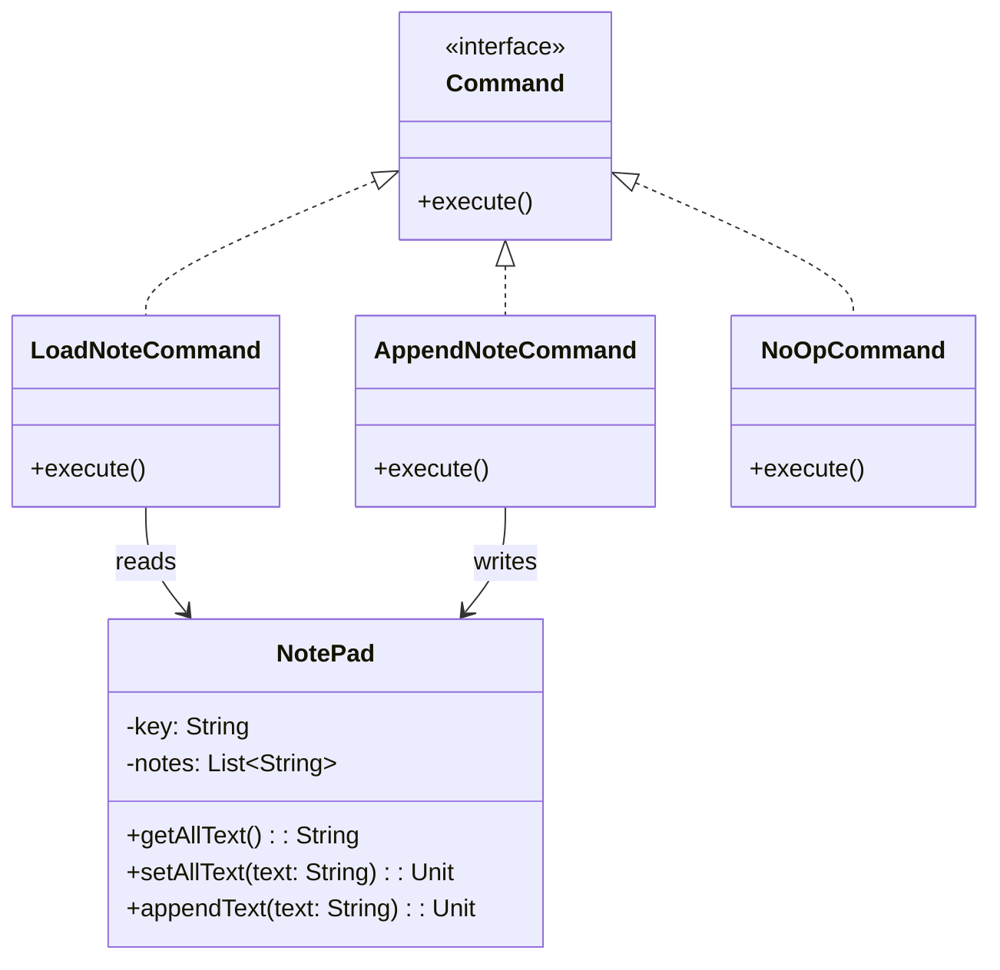

# **Dont Pad**

## Overview

Notepad application demonstrating the **Command Pattern** for managing text notes with load, append, and no-op commands, inspired by dontpad.com's simple document model.

---

## Tech Stack

- **Kotlin 2.2.20** → Modern JVM language with concise syntax and null safety.
- **Gradle** → Build automation tool with Kotlin DSL support.
- **JDK 25** → Required to run the application.
- **kotlin.test** → Testing framework.

---

## Architecture Diagram


```mermaid
classDiagram
    direction TB

    class NotePad {
        -key: String
        -notes: List~String~
        +getAllText(): String
        +setAllText(text: String): Unit
        +appendText(text: String): Unit
    }

    class Command {
        <<interface>>
        +execute()
    }

    class LoadNoteCommand {
        +execute()
    }

    class AppendNoteCommand {
        +execute()
    }

    class NoOpCommand {
        +execute()
    }

    Command <|.. LoadNoteCommand
    Command <|.. AppendNoteCommand
    Command <|.. NoOpCommand
    LoadNoteCommand --> NotePad: reads
    AppendNoteCommand --> NotePad: writes
```

---

## Setup Instructions

### 1 - Clone the Repository
```bash
git clone https://github.com/rbleggi/tech-pocs.git
cd kotlin/dont-pad
```

### 2 - Compile & Run the Application
```bash
./gradlew run
```

### 3 - Run Tests
```bash
./gradlew test
```
