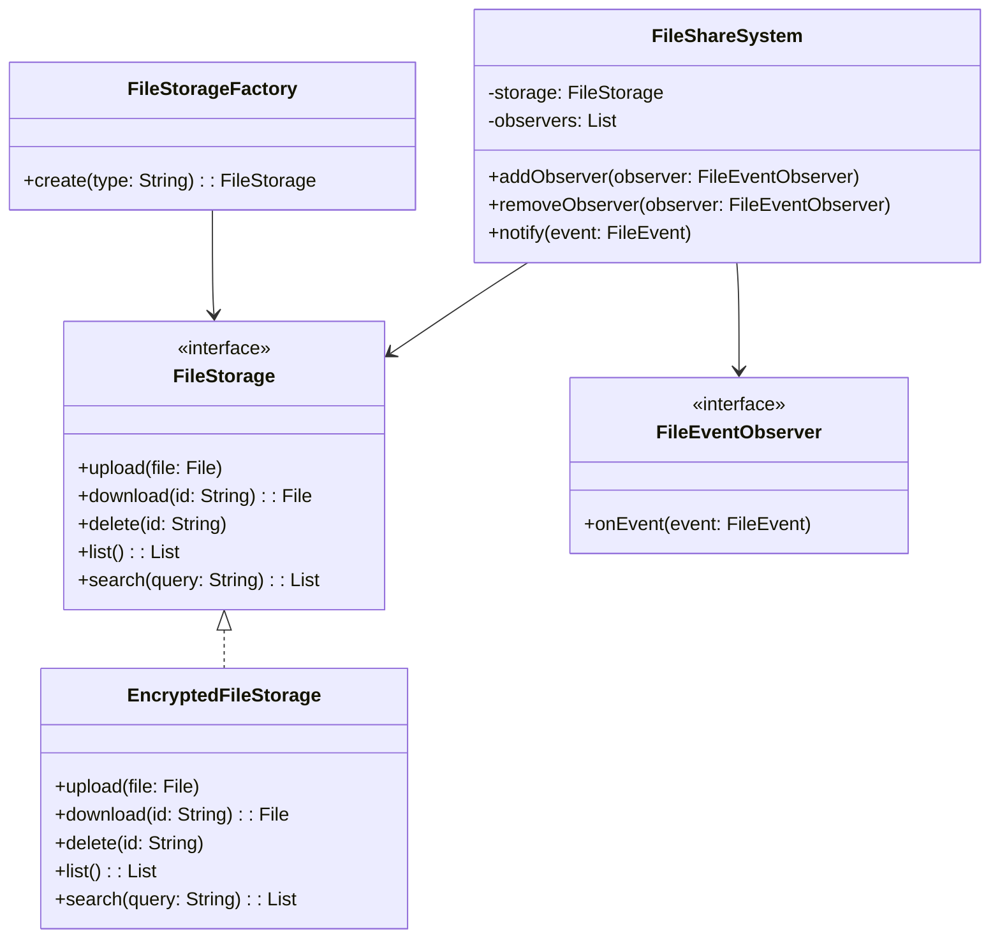

# File Share (Kotlin)

## Overview

A secure file sharing system using the Factory and Observer patterns. Supports file upload, download, delete, list, and search, with encrypted storage and event notifications.

---

## Tech Stack

- **Kotlin**
- **Gradle**
- **JDK 21+**

---

## Features

- Upload, download, delete, list, and search files
- Encrypted file storage
- Factory pattern for file storage backends
- Observer pattern for event notifications
- Extensible for new storage types and observers

---

## Architecture Diagram



---

## Setup Instructions

### 1️ - Clone the Repository

```bash
git clone https://github.com/rbleggi/tech-pocs.git
cd kotlin/file-share
```

### 2️ - Compile and Run the Application

```bash
./gradlew run
```

### 3️ - (Optional) Run the Tests

```bash
./gradlew test
```
