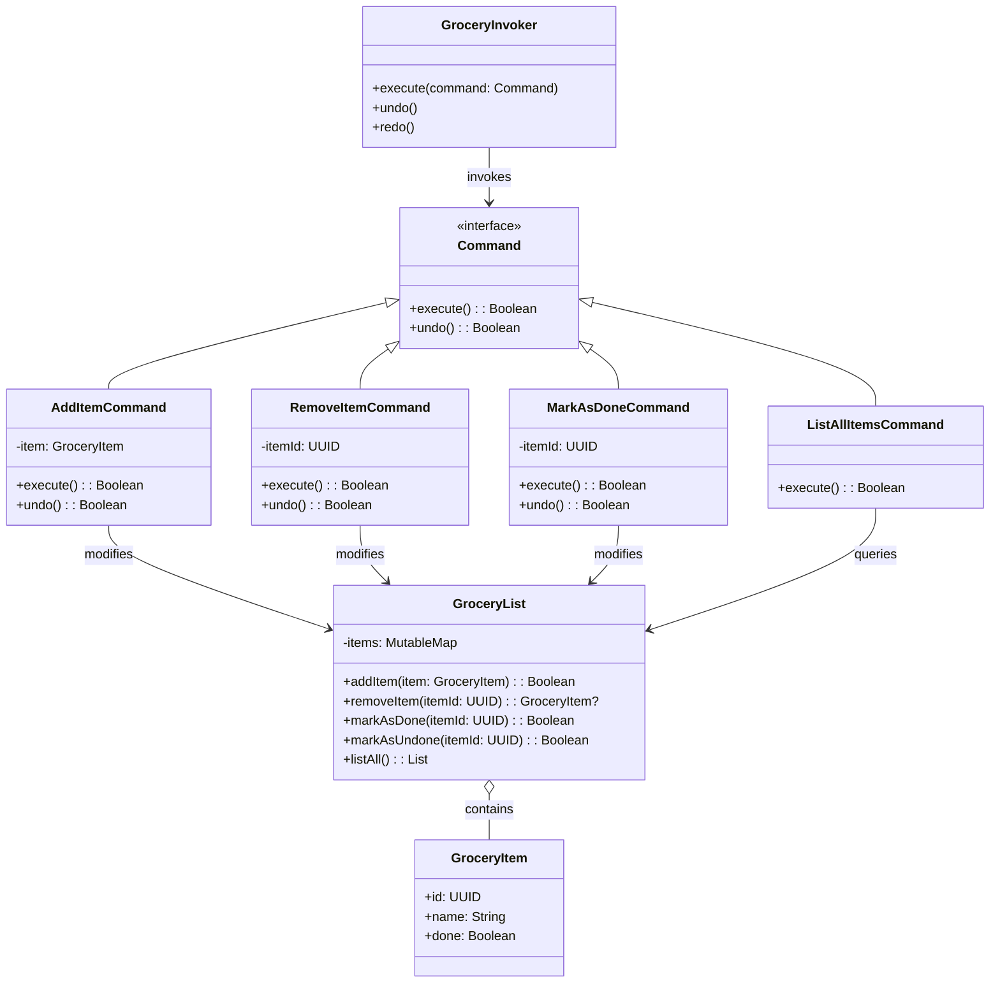

# **Grocery TODO List System (Kotlin)**

## **Overview**

This project implements a **flexible and maintainable Grocery TODO List system** using the **Command Pattern** in **Kotlin**. Users can add items, remove items, mark items as done, list all items, and use undo/redo for all actions.

---

## **Tech Stack**

- **Kotlin** → Modern JVM-based language with concise syntax and strong type safety.
- **Gradle** → Kotlin's build tool for JVM projects.
- **JDK 21** → Required to run the application.

---

## **Features**

- **Grocery Item Management** → Add, remove, list, and mark items as done.
- **Command Pattern** → Actions are encapsulated as commands for easy extension.
- **Undo/Redo** → All actions support undo and redo.
- **Logging** → Console output demonstrates the system in action.

---

## **Architecture Diagram**



---

## **Command Pattern**

The **Command Pattern** encapsulates requests as objects, allowing:

- Each grocery action is implemented as a separate `Command`.
- `GroceryInvoker` executes commands and manages undo/redo.
- Commands know how to execute and undo themselves.
- Easy extension with new commands without modifying existing code.
- Clean separation between the invoker and the receiver.

---

## **Setup Instructions**

### **1️ - Clone the Repository**

```shell
git clone https://github.com/rbleggi/tech-pocs.git
cd kotlin/grocery-todo-list
```

### **2️ - Compile & Run the Application**

```shell
./gradlew build
./gradlew run
```

### **3️ - Run Tests**

```shell
./gradlew test
```
