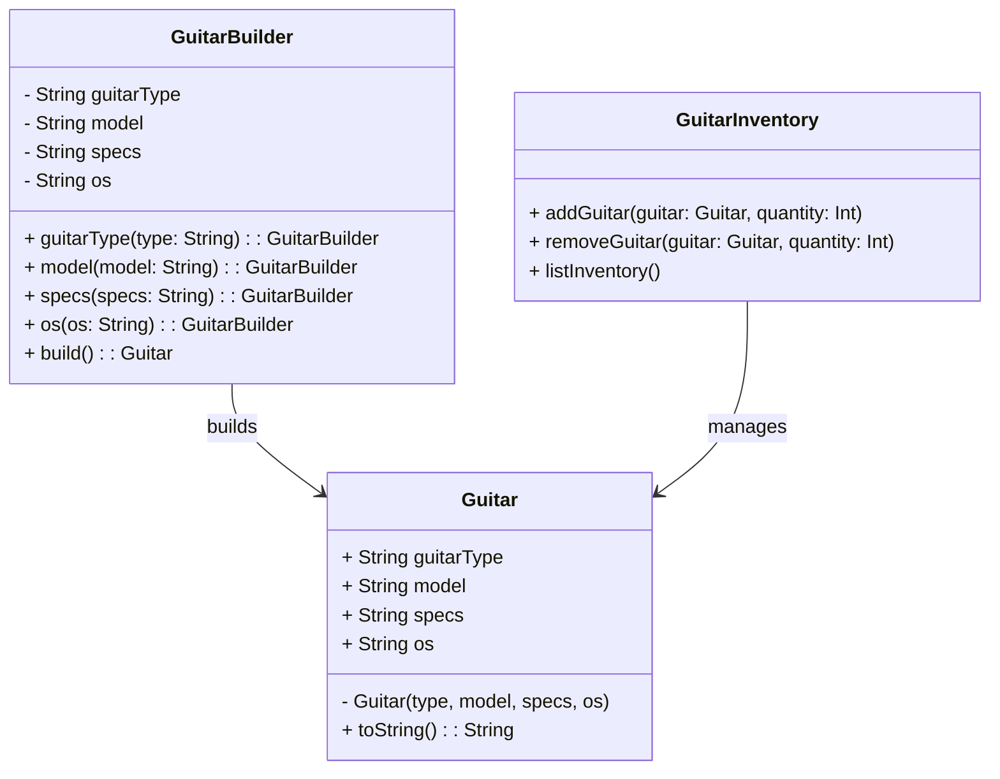

# **Guitar Factory (Kotlin)**

## Overview

This project implements a custom guitar factory system that allows users to flexibly create personalized guitars by specifying attributes such as type, model, specifications, and operating system. It also includes an inventory management system, tracking available guitars and their quantities.

---

## Tech Stack

- **Kotlin** → Modern JVM-based language with concise syntax and strong type safety.
- **Gradle** → Build automation tool for Kotlin projects.
- **JDK 25** → Required to run the application.

---

## Architecture Diagram



---

## Setup Instructions

### 1 - Clone the Repository

```bash
git clone https://github.com/rbleggi/tech-pocs.git
cd kotlin/guitar-factory
```

### 2 - Compile & Run the Application

```bash
./gradlew build run
```

### 3 - Run Tests

```bash
./gradlew test
```