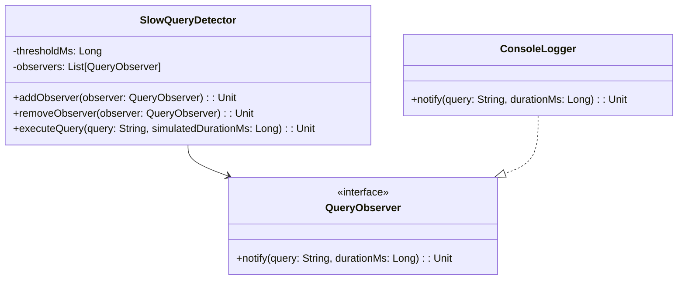

# **Hibernate Slow Query Detector (Kotlin)**

## Overview

This project demonstrates a Hibernate Slow Query Detector in Kotlin. The solution monitors query execution times and notifies observers when a query exceeds a configurable threshold. All logic is contained in a single file.

---

## Tech Stack

- **Kotlin** → Modern JVM-based language with advanced type safety and functional programming features.
- **Gradle** → Build tool with Kotlin DSL support.
- **JDK 25** → Required to run the application.

---

## Architecture Diagram



---

## Setup Instructions

### 1 - Clone the Repository

```bash
git clone https://github.com/rbleggi/tech-pocs.git
cd kotlin/hibernate-slow-query-detector
```

### 2 - Compile & Run the Application

```bash
./gradlew build run
```

### 3 - Run Tests

```bash
./gradlew test
```

