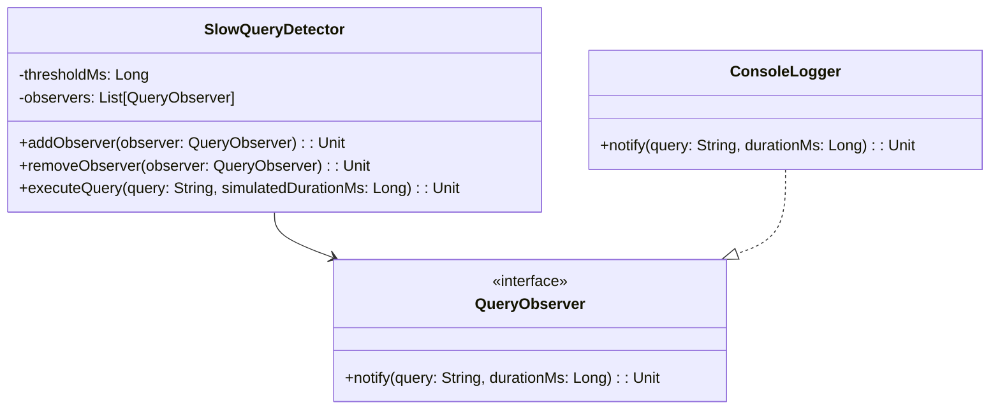

# **Hibernate Slow Query Detector (Kotlin)**

## **Overview**

This project demonstrates a Hibernate Slow Query Detector in Kotlin. The solution uses the Observer Pattern to monitor query execution times and notify observers when a query exceeds a configurable threshold. All logic is contained in a single file.

---

## **Tech Stack**

- **Kotlin** → Modern JVM-based language with advanced type safety and functional programming features.
- **Gradle** → Build tool with Kotlin DSL support.
- **JDK 21** → Required to run the application.

---

## **Features**

- **Slow Query Detection** → Notifies when a query exceeds the threshold.
- **Observer Pattern** → Extensible design for monitoring and notification.
- **Multiple Observers** → Support for adding/removing multiple observers.
- **Single File Implementation** → All logic is contained in one file for simplicity.
- **Configurable Threshold** → Set custom threshold for slow query detection.

---

## **Architecture Diagram**



---

## **Implementation Details**

- The solution uses the Observer Pattern: observers are notified when a query is slow.
- The `QueryObserver` interface defines the contract for notification handlers.
- The `SlowQueryDetector` class manages observers and detects slow queries based on a threshold.
- The `ConsoleLogger` class is a concrete implementation that logs to console.
- The main entry point demonstrates slow query detection with multiple queries.
- All logic is in a single Kotlin file with no comments.

---

## **Setup Instructions**

### **1️ - Clone the Repository**

```bash
git clone https://github.com/rbleggi/tech-pocs.git
cd kotlin/hibernate-slow-query-detector
```

### **2️ - Compile & Run the Application**

```bash
./gradlew run
```

### **3️ - Run Tests**

```bash
./gradlew test
```

