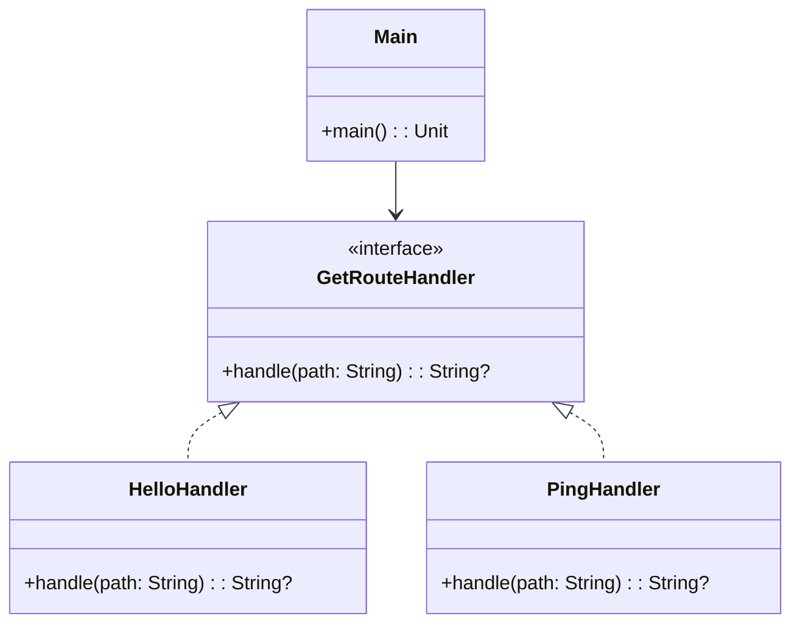

# Kotlin HTTP Server

## Overview

This project implements a simple and extensible HTTP server in Kotlin using the Strategy Pattern. It supports custom GET endpoints and demonstrates how to compose route handlers in a clean, extensible way.

---

## **Tech Stack**

- **Kotlin** → Modern JVM-based language with advanced type safety and functional programming features.
- **Gradle** → Kotlin's official build tool.
- **JDK 21** → Required to run the application.

---

## Features
- **GET endpoints**: Easily add new GET routes
- **Strategy Pattern**: Add new route handlers by implementing the `GetRouteHandler` interface
- **Simple CLI**: Run the server from the command line
- **Extensible**: Add new endpoints without changing the server core

---

## Architecture Diagram



---

## Implementation Details

- The server uses the `GetRouteHandler` interface, which defines the method `handle(path: String): String?`.
- Concrete implementations (e.g., `HelloHandler`, `PingHandler`) handle specific GET endpoints.
- The `main` function starts the server, composes handlers, and dispatches requests to the appropriate handler.
- To add new endpoints, implement the `GetRouteHandler` interface and add your handler to the list in `main`.

---

## **Setup Instructions**

### **1️ - Clone the Repository**

```bash
git clone https://github.com/rbleggi/tech-pocs.git
cd kotlin/http-server
```

### **2️ - Compile & Run the Application**

```shell
./gradlew build run
```

### **3️ - Run Tests**

```shell
./gradlew test
```
