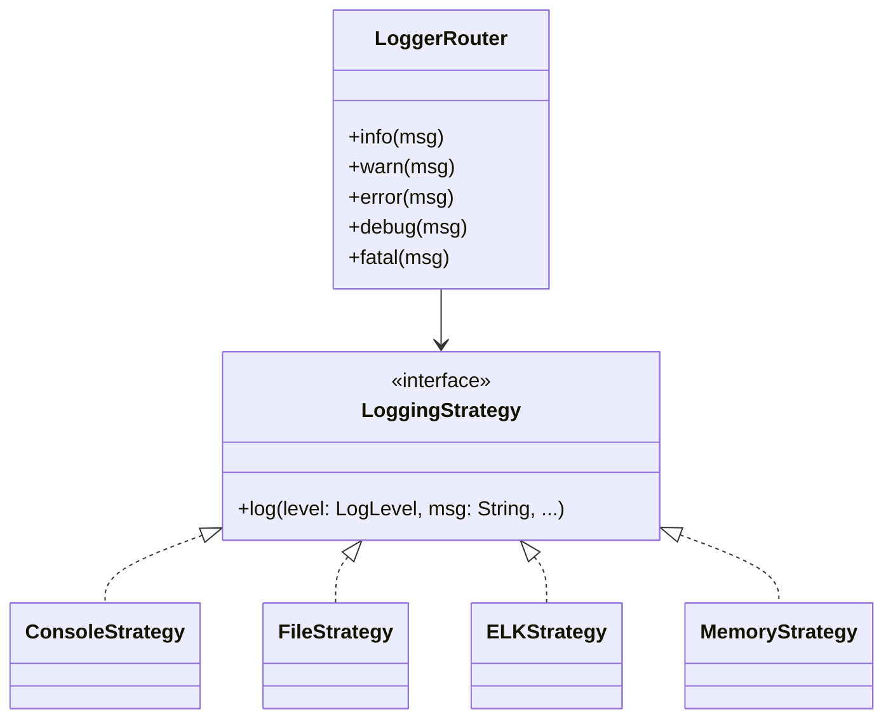

# Logger Router (Kotlin)

## Overview

A flexible logging system using the **Strategy Pattern**. Supports multiple logging backends (File System, ELK, Console, Memory) with unified API and automatic fallback.

---

## Tech Stack

- **Kotlin** → Modern JVM-based language
- **Gradle** → Build tool
- **JDK 21+** → Required to run

---

## Features

- Multiple strategies: Console, File, ELK, Memory
- Unified logging API
- Colored output for console
- Thread-safe file logging
- ELK integration with health checks
- In-memory logging for testing
- Log level filtering (DEBUG, INFO, WARN, ERROR, FATAL)
- Automatic fallback on strategy failure

---

## Architecture Diagram



---

## **Setup Instructions**

### **1️ - Clone the Repository**

```bash
git clone https://github.com/rbleggi/tech-pocs.git
cd kotlin/murder-mistery-game
```

### **2️ - Compile and Run the Application**

```bash
./gradlew run
```

### **3️ - (Optional) Run the Tests**

```bash
./gradlew test
```