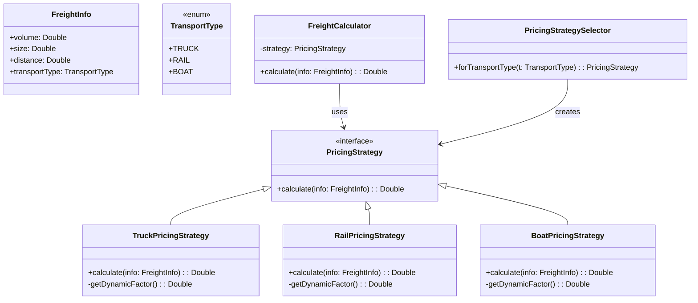

# **Logistic Pricing (Kotlin)**

## Overview

This project implements a modular and extensible freight pricing system in Kotlin. Freight costs are dynamically calculated based on factors like volume, size, and transport type such as Truck, Rail, or Boat with prices subject to real-time variability.

---

## Tech Stack

- **Kotlin** → Modern JVM-based language with concise syntax and strong type safety.
- **Gradle** → Build automation tool for Kotlin projects.
- **JDK 25** → Required to run the application.

---

## Architecture Diagram



---

## Setup Instructions

### 1 - Clone the Repository

```bash
git clone https://github.com/rbleggi/tech-pocs.git
cd kotlin/logistic-pricing
```

### 2 - Compile & Run the Application

```bash
./gradlew build run
```

### 3 - Run Tests

```bash
./gradlew test
```
