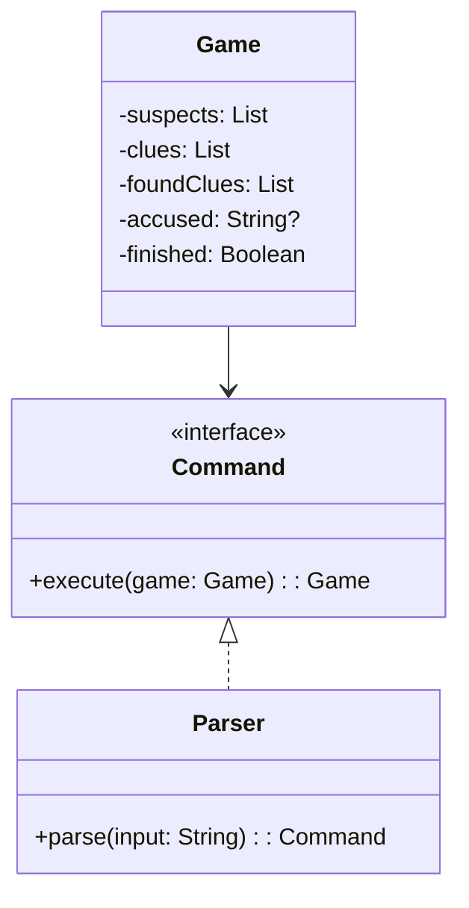

# **Murder Mystery Game (Kotlin)**

## Overview

This project implements a simple terminal-based Murder Mystery game in Kotlin. The player interacts via commands to find clues and accuse suspects.

---

## Tech Stack

- **Kotlin** → Modern JVM language with functional and object-oriented features.
- **Gradle** → Official build tool for Kotlin/JVM projects.
- **JDK 25** → Required to run the application.

---

## Architecture Diagram



---

## Setup Instructions

### 1 - Clone the Repository

```bash
git clone https://github.com/rbleggi/tech-pocs.git
cd kotlin/murder-mistery-game
```

### 2 - Compile & Run the Application

```bash
./gradlew build run
```

### 3 - Run Tests

```bash
./gradlew test
```
