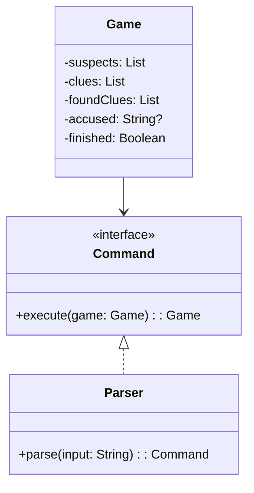

# **Murder Mystery Game**

## **Overview**

This project implements a simple terminal-based Murder Mystery game in Kotlin. The player interacts via commands to find clues and accuse suspects. The solution uses the Command pattern to handle user actions and game logic.

---

## **Tech Stack**

- **Kotlin** → Modern JVM language with functional and object-oriented features.
- **Gradle** → Official build tool for Kotlin/JVM projects.
- **JDK 21** → Required to run the application.

---

## **Features**

- **Terminal Interaction** → Play entirely through the terminal.
- **Command Pattern** → Each user action is encapsulated as a command.
- **Simple Game Logic** → Find clues and accuse suspects to solve the mystery.
- **Single File Implementation** → All logic is in a single file for simplicity.

---

## **Architecture Diagram**



---

## **Implementation Details**

- The game uses the Command pattern: each action (show suspects, find clue, accuse, etc.) is a Command object.
- The main entry point is the `fun main()` function, which starts the game loop and processes user input.
- All logic is in a single Kotlin file, without comments.
- To play, run the application and use commands like `suspects`, `clues`, `find <clue>`, `accuse <suspect>`, `help`, and `exit`.

---

## **Setup Instructions**

### **1️ - Clone the Repository**

```bash
git clone https://github.com/rbleggi/tech-pocs.git
cd kotlin/murder-mistery-game
```

### **2️ - Compile and Run the Application**

```bash
./gradlew run
```

### **3️ - (Optional) Run the Tests**

```bash
./gradlew test
```
