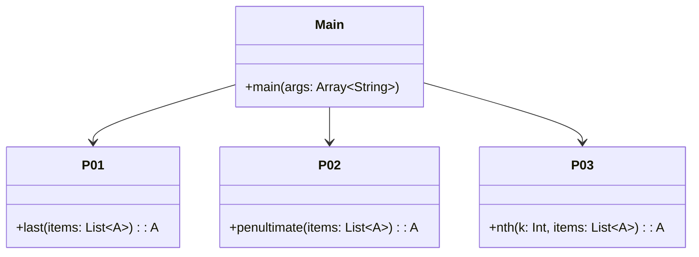

# **Ninety-Nine Kotlin Problems**

## Overview

Solutions to the classic 99 Prolog Problems adapted for Kotlin, demonstrating idiomatic functional programming with tail recursion, pattern matching via when expressions, and higher-order functions on lists.

---

## Tech Stack

- **Kotlin 2.2.20** → Modern JVM language with functional programming and null safety.
- **Gradle** → Build automation tool with Kotlin DSL support.
- **JDK 25** → Required to run the application.
- **kotlin.test** → Testing framework.

---

## Architecture Diagram



---

## Setup Instructions

### 1 - Clone the Repository
```bash
git clone https://github.com/rbleggi/tech-pocs.git
cd kotlin/ninety-nine
```

### 2 - Build the Project
```bash
./gradlew build
```

### 3 - Run Tests
```bash
./gradlew test
```
