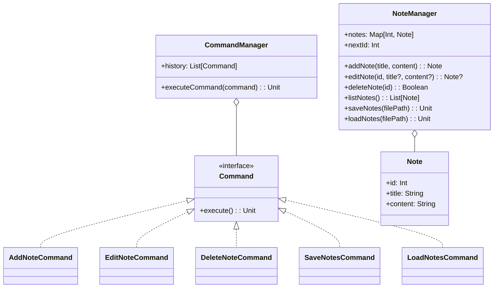

# **Note Taking System**

## **Overview**

This project implements a **flexible and maintainable note-taking system** using the **Command Pattern**. Users can add, edit, delete, save, and load notes with file persistence support.

---

## **Tech Stack**

- **Kotlin** → Modern JVM-based language with advanced type safety and functional programming features.
- **Gradle** → Kotlin's official build tool.
- **JDK 24** → Required to run the application.

---

## **Features**

- **Note Management** → add, edit, delete, list notes
- **File Persistence** → save and load notes from file
- **Command Pattern** → Each operation is encapsulated as a command for easy extension
- **Action History** → Commands are stored for potential undo/redo functionality
- **Type Safety** → Kotlin's null safety prevents common errors

---

## **Architecture Diagram**



---

## **Command Pattern**

The **Command Pattern** encapsulates each operation (add, edit, delete, save, load) as a command object. This allows:

- Each action is implemented as a separate `Command`.
- `CommandManager` maintains history for potential undo/redo functionality.
- Easy extension with new commands without modifying existing code.
- Clean separation between the invoker (`CommandManager`) and the receiver (`NoteManager`).
- Simple and maintainable code structure.

---

## **Setup Instructions**

### **1️ - Clone the Repository**

```shell
git clone https://github.com/rbleggi/tech-pocs.git
cd kotlin/note-taking
```

### **2️ - Compile & Run the Application**

```shell
./gradlew build
./gradlew run
```

### **3️ - Run Tests**

```shell
./gradlew test
```

