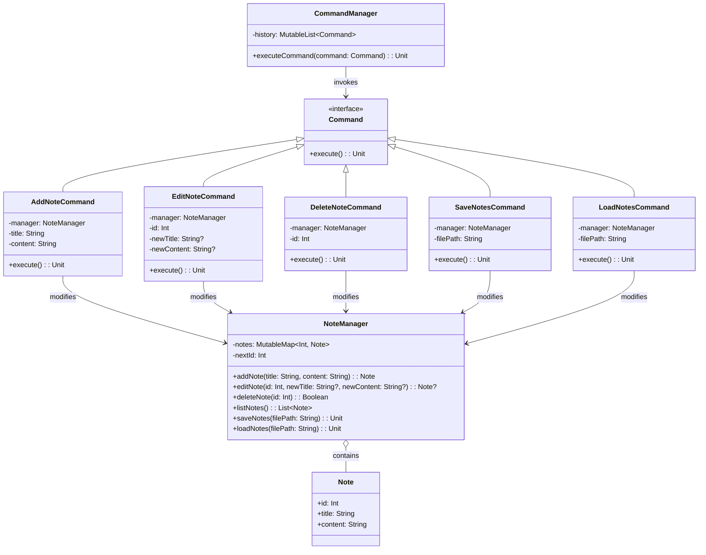

# **Note Taking System (Kotlin)**

## **Overview**

A **flexible and maintainable note-taking system** using the **Command Pattern**. Users can add, edit, delete, save, and load notes. The system is designed to be extensible and supports action history for potential undo/redo functionality.

---

## **Tech Stack**

- **Kotlin** → Modern JVM-based language with advanced type safety and functional programming features.
- **Gradle** → Build tool with Kotlin DSL support.
- **JDK 24** → Required to run the application.

---

## **Features**

- **Note Management** → Add, edit, delete, save, and load notes
- **Command Pattern** → Actions are encapsulated as commands for easy extension
- **Action History** → Commands are stored in a list for potential undo/redo functionality
- **File Persistence** → Notes can be saved to and loaded from a file
- **Type Safety** → Kotlin's null safety prevents common errors

---

## **Architecture Diagram**



---

## **Command Pattern**

The **Command Pattern** encapsulates requests as objects, allowing:
- Each note management action is implemented as a separate `Command`
- `CommandManager` maintains a history of executed commands for potential undo/redo functionality
- Commands know how to execute themselves
- Easy extension with new commands without modifying existing code
- Clean separation between the invoker (`CommandManager`) and the receiver (`NoteManager`)

---

## **Usage Examples**

### Basic Note Operations
```kotlin
val manager = NoteManager()
val commandManager = CommandManager()

// Add notes
commandManager.executeCommand(AddNoteCommand(manager, "First Note", "This is the content."))
commandManager.executeCommand(AddNoteCommand(manager, "Second Note", "More content."))

// Edit note
commandManager.executeCommand(EditNoteCommand(manager, 1, "Updated Title", null))

// Delete note
commandManager.executeCommand(DeleteNoteCommand(manager, 2))

// Save to file
commandManager.executeCommand(SaveNotesCommand(manager, "notes.txt"))

// Load from file
commandManager.executeCommand(LoadNotesCommand(manager, "notes.txt"))
```

---

## **Setup Instructions**

### **1️ - Clone the Repository**

```bash
git clone https://github.com/rbleggi/tech-pocs.git
cd kotlin/note-taking
```

### **2️ - Compile & Run the Application**

```shell
./gradlew run
```

### **3️ - Build JAR**

```shell
./gradlew jar
```

### **4️ - Run Tests**

```shell
./gradlew test
```

---

## **Implementation Details**

### Domain Model
```kotlin
data class Note(val id: Int, val title: String, val content: String)
```

### Command Interface
```kotlin
interface Command {
    fun execute()
}
```

### Key Classes
- **NoteManager** - Manages note CRUD operations and persistence
- **CommandManager** - Executes commands and maintains history
- **AddNoteCommand** - Command to add a new note
- **EditNoteCommand** - Command to edit an existing note
- **DeleteNoteCommand** - Command to delete a note
- **SaveNotesCommand** - Command to save notes to file
- **LoadNotesCommand** - Command to load notes from file

---

## **Project Structure**

```
note-taking/
├── src/
│   ├── main/kotlin/com/rbleggi/notetaking/
│   │   └── Main.kt              # Core implementation
│   └── test/kotlin/com/rbleggi/notetaking/
│       ├── NoteManagerTest.kt   # NoteManager tests
│       └── CommandTest.kt       # Command pattern tests
├── build.gradle.kts             # Build configuration
└── README.md                    # This file
```

