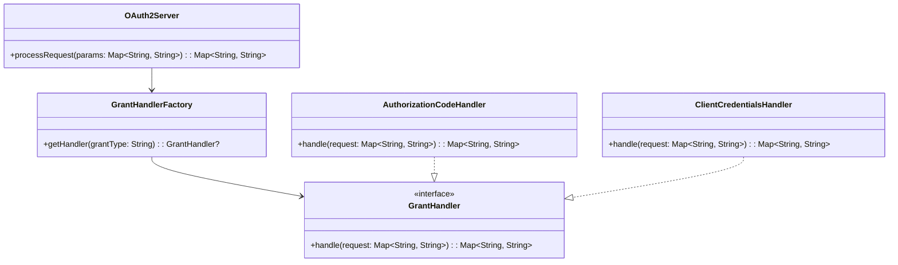

# **OAuth 2.0 Server (Kotlin)**

## Overview

This project demonstrates a minimal OAuth 2.0 Server in Kotlin to handle extensible grant types. The solution allows easy addition of new OAuth 2.0 flows and contains all logic in a single file.

---

## Tech Stack

- **Kotlin** → Modern JVM-based language with concise syntax and strong type safety.
- **Gradle** → Build tool for JVM projects.
- **JDK 25** → Required to run the application.

---

## Architecture Diagram



---

## Setup Instructions

### 1 - Clone the Repository

```bash
git clone https://github.com/rbleggi/tech-pocs.git
cd kotlin/oauth2
```

### 2 - Compile & Run the Application

```bash
./gradlew build run
```

### 3 - Run Tests

```bash
./gradlew test
```