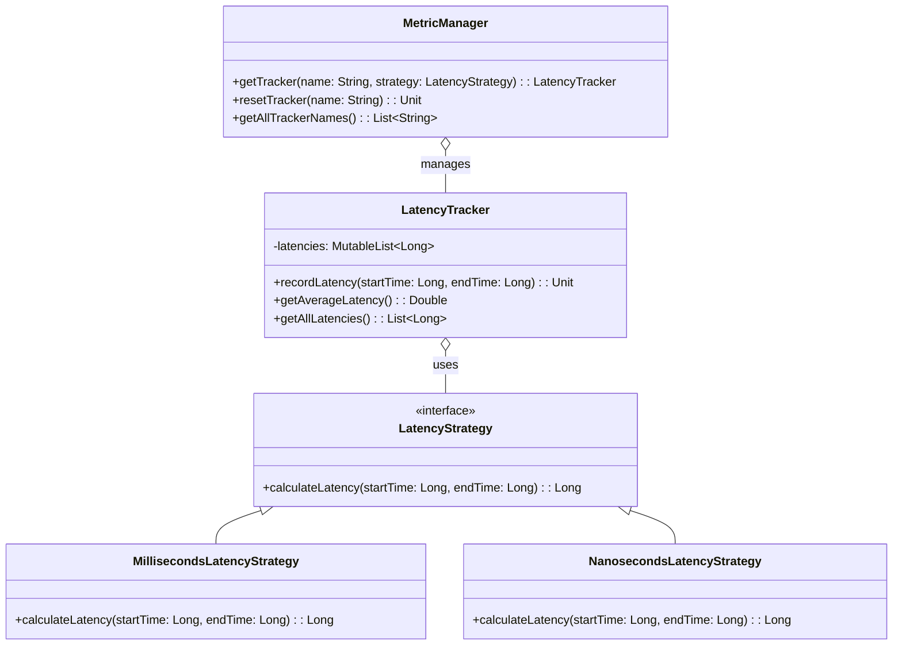

# Observability Framework

## Overview

This project implements a simple and extensible framework for latency observability using the **Strategy Pattern** in Kotlin. It allows you to define different latency calculation strategies and manage multiple metric trackers flexibly.

## Features

- **Latency Strategies** → Easily calculate latency in milliseconds or nanoseconds.
- **Strategy Pattern** → Add new calculation strategies by implementing the `LatencyStrategy` interface.
- **Metrics Management** → Create, retrieve, and reset named latency trackers.
- **Extensible** → Add new strategies or metric types without changing the core framework.

---

## Architecture Diagram



---

## Strategy Pattern

The **Strategy Pattern** allows defining a family of algorithms, encapsulating them, and making them interchangeable. In this project:

- Each latency calculation strategy is implemented as a class that implements `LatencyStrategy`.
- The `LatencyTracker` receives a strategy and uses it to calculate the latency of each recorded operation.
- The `MetricManager` manages multiple latency trackers, each potentially using a different strategy.
- New strategies can be added without modifying the existing code.

---

## Setup Instructions

1. **Clone the Repository**:
   ```bash
   git clone https://github.com/rbleggi/tech-pocs.git
   cd kotlin/observability-framework
   ```

2. **Compiling & Running**:
   ```bash
   ./gradlew build run
   ```

3. **Tests**:
   ```bash
   ./gradlew test
   ```
