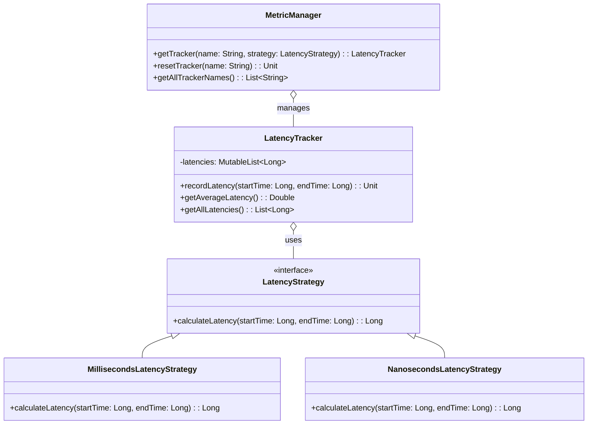

# **Observability Framework (Kotlin)**

## Overview

This project implements a simple and extensible framework for latency observability in Kotlin. It allows you to define different latency calculation strategies and manage multiple metric trackers flexibly.

---

## Tech Stack

- **Kotlin** → Modern JVM-based language with advanced type safety and functional programming features.
- **Gradle** → Kotlin's official build tool.
- **JDK 25** → Required to run the application.

---

## Architecture Diagram



---

## Setup Instructions

### 1 - Clone the Repository

```bash
git clone https://github.com/rbleggi/tech-pocs.git
cd kotlin/observability-framework
```

### 2 - Compile & Run the Application

```bash
./gradlew build run
```

### 3 - Run Tests

```bash
./gradlew test
```
