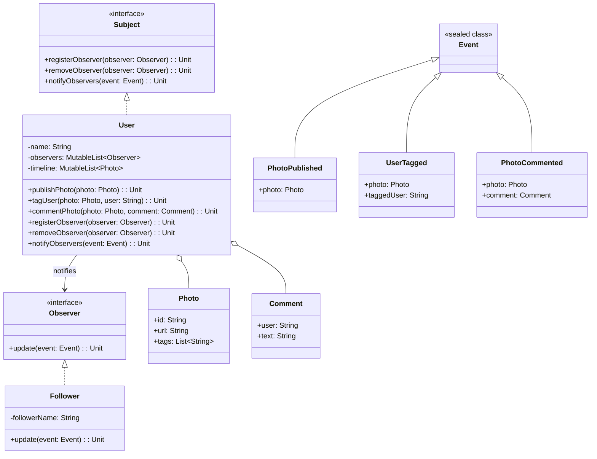

# **Social Media Sharing Photo App**

## **Overview**

A modular social media photo sharing PoC in Kotlin, demonstrating core features (publish, tag, timeline, comments) and event-driven notifications using the **Observer Pattern**. Followers are notified when users publish, tag, or comment on photos.

---

## **Tech Stack**

- **Kotlin** → Modern JVM-based language with concise syntax and strong type safety.
- **Gradle** → Build automation tool for Kotlin projects.
- **JDK 21** → Required to run the application.

---

## **Features**

- **Observer Pattern** → Decouples user actions from notification logic
- **Photo Publishing** → Users can publish photos to their timeline
- **Tagging** → Tag users in photos
- **Timeline** → View a timeline of published photos and activities
- **Comments** → Add and view comments on photos
- **Notification System** → Followers receive notifications for new photos, tags, and comments
- **Easily Extensible** → Add new event types or observers without changing core logic

---

## **Architecture Diagram**



---

## **Observer Pattern**

The **Observer Pattern** allows the app to notify followers automatically when a user publishes, tags, or comments on a photo. This decouples the notification logic from user actions, making the system modular and extensible.

**Key Benefits:**
- **Decoupling** → Observers don't need to know about each other
- **Dynamic Subscription** → Followers can subscribe/unsubscribe at runtime
- **Event-Driven** → Uses sealed classes for type-safe event handling
- **Extensibility** → New event types can be added without modifying existing code

---

## **Setup Instructions**

### **1️ - Clone the Repository**

```bash
git clone https://github.com/rbleggi/tech-pocs.git
cd kotlin/social-media-photo-app
```

### **2️ - Compile & Run the Application**

```bash
./gradlew build
./gradlew run
```

### **3️ - Run Tests**

```bash
./gradlew test
```

---

## **License**

MIT