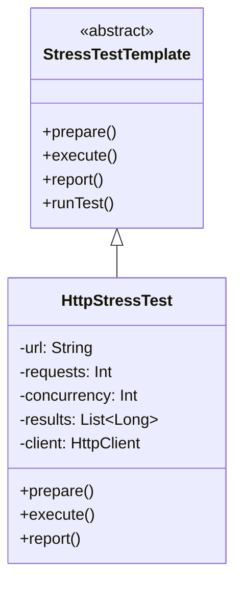

# HTTP Stress Test Framework

## Overview

This project implements a stress test framework for HTTP endpoints using Kotlin. It allows users to configure the number of requests, concurrency level, and target URL to evaluate the performance and reliability of HTTP services under load.

The solution utilizes the Template Method Pattern to structure the stress test workflow, ensuring extensibility and clear separation of preparation, execution, and reporting phases.

---

## Tech Stack

- **Kotlin** - Modern JVM-based language with concise syntax and strong type safety.
- **Gradle** - Build tool for JVM projects.
- **Kotlin Coroutines** - For concurrent HTTP request execution.
- **JDK 21** - Required to run the application.

---

## Features

- **Configurable HTTP Stress Testing** - Set target URL, number of requests, and concurrency level.
- **Performance Metrics** - Reports total requests, average, minimum, and maximum response times.
- **Template Method Pattern** - Organizes the test workflow for extensibility and clarity.
- **Coroutine-based Concurrency** - Efficient concurrent request execution using Kotlin coroutines.
- **Single File Implementation** - All logic is contained in one Kotlin file for simplicity.
- **Scalability** - Easily extendable to support additional protocols or test strategies.

---

## Architecture Diagram



---

## Template Method Pattern

The Template Method Pattern defines the skeleton of an algorithm in a base class, allowing subclasses to override specific steps without changing the overall structure. In this project:

- `StressTestTemplate` defines the workflow: prepare, execute, and report.
- `HttpStressTest` implements each step for HTTP stress testing.
- The `runTest()` method enforces the execution order.
- New test types can be added by extending `StressTestTemplate`.

---

## Setup Instructions

### 1 - Clone the Repository

```bash
git clone https://github.com/rbleggi/tech-pocs.git
cd kotlin/stress-test-http-framework
```

### 2 - Compile & Run the Application

```bash
./gradlew build
./gradlew run
```

### 3 - Run Tests

```bash
./gradlew test
```
