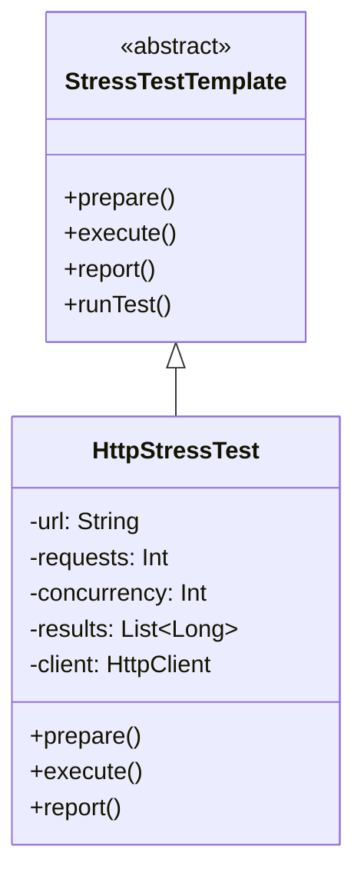

# **HTTP Stress Test Framework (Kotlin)**

## Overview

This project implements a stress test framework for HTTP endpoints using Kotlin. It allows users to configure the number of requests, concurrency level, and target URL to evaluate the performance and reliability of HTTP services under load.

---

## Tech Stack

- **Kotlin** → Modern JVM-based language with concise syntax and strong type safety.
- **Gradle** → Build tool for JVM projects.
- **Kotlin Coroutines** → For concurrent HTTP request execution.
- **JDK 25** → Required to run the application.

---

## Architecture Diagram



---

## Setup Instructions

### 1 - Clone the Repository

```bash
git clone https://github.com/rbleggi/tech-pocs.git
cd kotlin/stress-test-http-framework
```

### 2 - Compile & Run the Application

```bash
./gradlew build run
```

### 3 - Run Tests

```bash
./gradlew test
```
