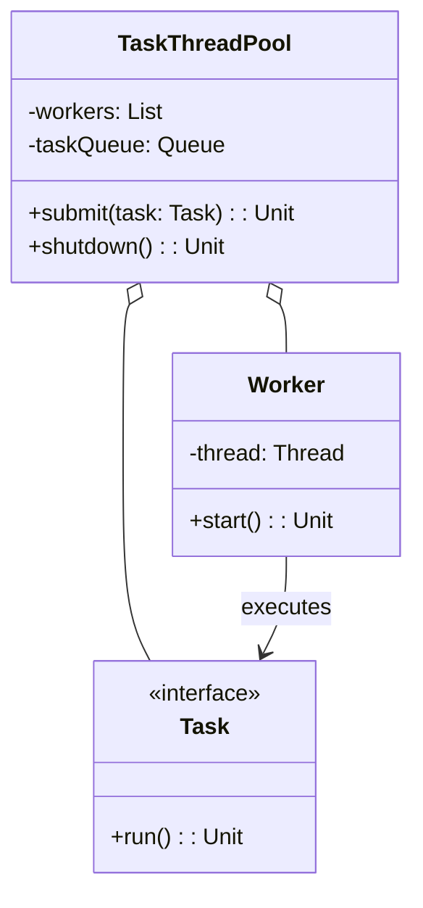

# Task ThreadPool (Kotlin)

## Overview

A modular Kotlin PoC for concurrent task execution using a custom thread pool. Demonstrates core features: task submission, thread pool management, and graceful shutdown. All logic is contained in a single file for simplicity and easy extensibility.

---

## Tech Stack

- **Kotlin** → Modern JVM-based language with concise syntax and strong type safety.
- **Gradle** → Build tool for Kotlin projects.
- **JDK 21** → Required to run the application.

---

## Features

- **Task Submission** → Submit tasks for concurrent execution
- **Thread Pool Management** → Custom thread pool with configurable workers
- **Graceful Shutdown** → Safe pool shutdown and task completion
- **Simple API** → Minimal, extensible interface for real-world use
- **Easily Extensible** → Add new task types or pool strategies without changing core logic
- **Single File Implementation** → All logic in one file for clarity

---

## Architecture Diagram



---

## Thread Pool Pattern

The **Thread Pool Pattern** enables efficient, reusable management of concurrent tasks. Tasks are submitted to a queue and executed by a fixed set of worker threads, improving resource usage and throughput for parallel workloads.

---

## Setup Instructions

### 1 - Clone the Repository

```cmd
git clone https://github.com/rbleggi/tech-pocs.git
cd kotlin\task-threadpool
```

### 2 - Compile & Run the Application

```cmd
gradlew.bat run
```

### 3 - Run Tests

```cmd
gradlew.bat test
```

