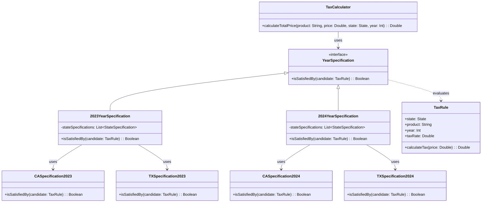
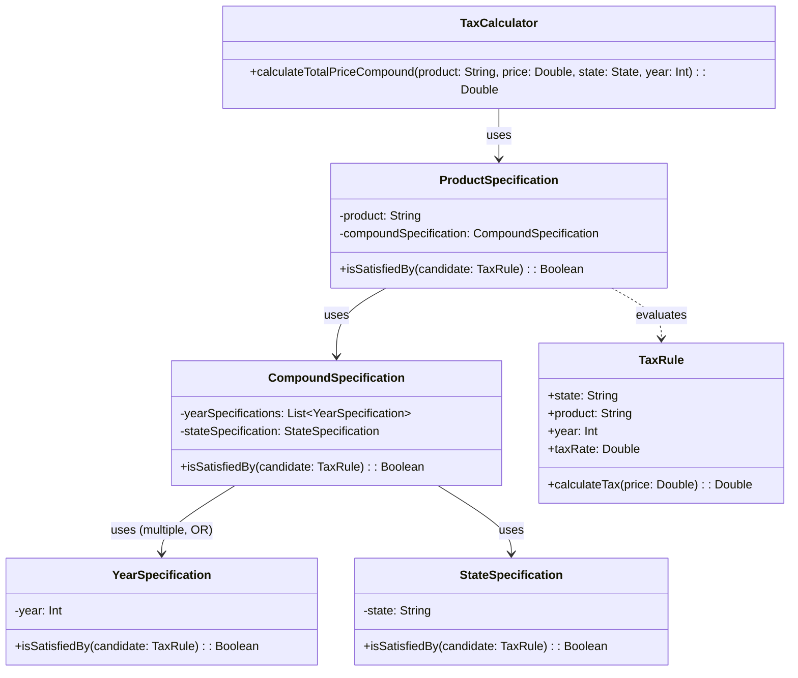

# TAX System Project

## Overview

This project demonstrates a flexible tax calculation system that calculates product prices based on tax rules defined by **year**, **state**, and **product**.

- **Kotlin** → A concise, modern JVM-based language.

---

## Features

- **Scalable Architecture**: Easily extendable to include more rules or criteria.
- **Specification Pattern**: Allows clear and flexible rules for filtering taxes by year, state, or product.

---

## Implementations

### 1. **Specific Specifications**



#### **Advantages:**
- Clear domain modeling with explicit rules.
- Easy to debug and maintain simple use-cases.
- Straightforward logic and readability.

#### **Drawbacks:**
- Code duplication across similar classes.
- High coupling and low scalability.
- Complex to extend with many states or years.

---

### 2. **Compound Specification**



#### **Advantages:**
- Highly flexible composition of rules.
- Reduces redundancy and improves scalability.
- Easy to extend to new specifications (years/states/products).

#### ️ **Drawbacks:**
- Slightly increased complexity for newcomers.
- Harder debugging due to dynamic rule composition.

---

## Prerequisites

- **JDK 21** → Ensure Java is installed.
- **Gradle** → Used for dependency management.

---

## Setup Instructions

1. **Clone the Repository**:
   ```bash
   git clone https://github.com/rbleggi/tech-pocs.git
   cd kotlin/tax-system
   ```

2. **Compiling & Running**:
   ```sh
   ./gradlew build run
   ```

3. **Tests**:
   ```sh
   ./gradlew test
   ```