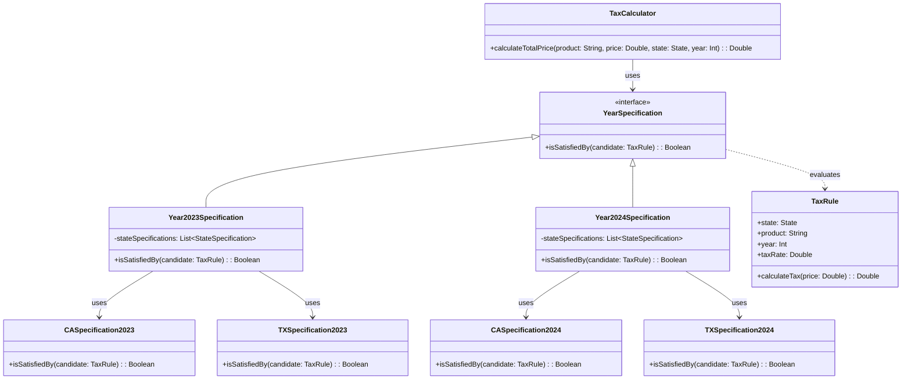

# **TAX System (Kotlin)**

## Overview

This project demonstrates a flexible tax calculation system that calculates product prices based on tax rules defined by year, state, and product.

---

## Tech Stack

- **Kotlin 2.2.20** -> Modern JVM-based language with concise syntax and strong type safety.
- **Gradle** -> Build tool for Kotlin projects.
- **JDK 25** -> Required to run the application.

---

## Architecture Diagram


```mermaid
classDiagram

   class YearSpecification {
      <<interface>>
      +isSatisfiedBy(candidate: TaxRule): Boolean
   }

   class Year2023Specification {
      -stateSpecifications: List~StateSpecification~
      +isSatisfiedBy(candidate: TaxRule): Boolean
   }

   class Year2024Specification {
      -stateSpecifications: List~StateSpecification~
      +isSatisfiedBy(candidate: TaxRule): Boolean
   }

   class CASpecification2023 {
      +isSatisfiedBy(candidate: TaxRule): Boolean
   }

   class TXSpecification2023 {
      +isSatisfiedBy(candidate: TaxRule): Boolean
   }

   class CASpecification2024 {
      +isSatisfiedBy(candidate: TaxRule): Boolean
   }

   class TXSpecification2024 {
      +isSatisfiedBy(candidate: TaxRule): Boolean
   }

   class TaxRule {
      +state: State
      +product: String
      +year: Int
      +taxRate: Double
      +calculateTax(price: Double): Double
   }

   class TaxCalculator {
      +calculateTotalPrice(product: String, price: Double, state: State, year: Int): Double
   }

   YearSpecification <|-- Year2023Specification
   YearSpecification <|-- Year2024Specification

   Year2023Specification --> CASpecification2023 : uses
   Year2023Specification --> TXSpecification2023 : uses
   Year2024Specification --> CASpecification2024 : uses
   Year2024Specification --> TXSpecification2024 : uses

   TaxCalculator --> YearSpecification : uses
   YearSpecification ..> TaxRule : evaluates
```

---

## Setup Instructions

### 1 - Clone the Repository

```bash
git clone https://github.com/rbleggi/tech-pocs.git
cd kotlin/tax-system
```

### 2 - Compile & Run the Application

```bash
./gradlew run
```

### 3 - Run Tests

```bash
./gradlew test
```