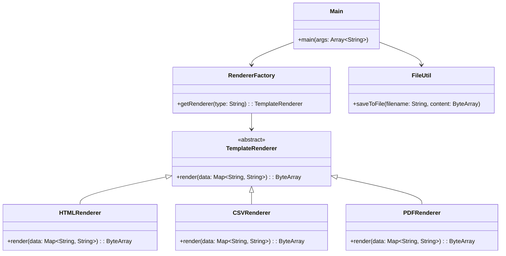

# **Template Renderer**

## Overview

Template rendering system demonstrating the **Factory Pattern** for generating output in HTML, CSV, and PDF formats from a common data model, with each renderer encapsulated behind a shared interface.

---

## Tech Stack

- **Kotlin 2.1.10** → Modern JVM language with concise syntax and null safety.
- **Gradle** → Build automation tool with Kotlin DSL support.
- **JDK 25** → Required to run the application.
- **iText 9** → PDF generation library.
- **JUnit 5 + MockK** → Testing framework and mocking library.

---

## Architecture Diagram



---

## Setup Instructions

### 1 - Clone the Repository
```bash
git clone https://github.com/rbleggi/tech-pocs.git
cd kotlin/template-renderer
```

### 2 - Build the Project
```bash
./gradlew build
```

### 3 - Run Tests
```bash
./gradlew test
```
