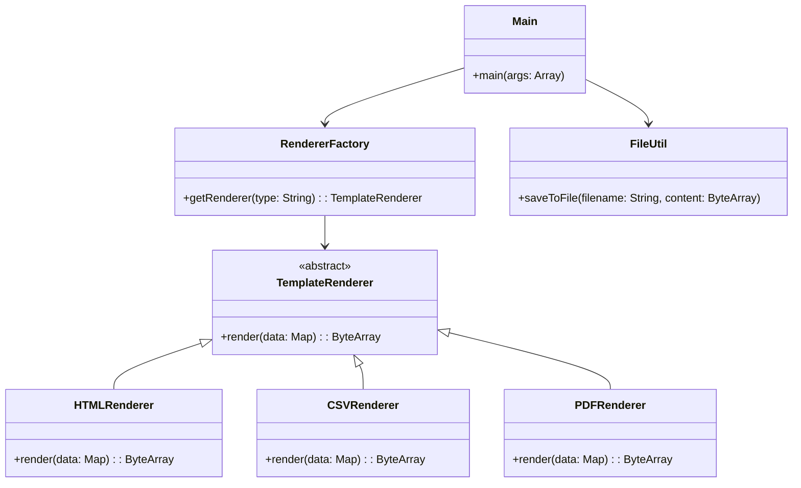

# **Template Renderer (Kotlin)**

## Overview

This project implements a template renderer that generates output in HTML, CSV, and PDF formats using Kotlin.

---

## Tech Stack

- **Kotlin** → Modern JVM-based language with concise syntax and strong type safety.
- **Gradle** → Build tool for Kotlin projects.
- **iText** → Library for PDF generation.
- **JDK 25** → Required to run the application.

---

## Architecture Diagram



---

## Setup Instructions

### 1 - Clone the Repository

```bash
git clone https://github.com/rbleggi/tech-pocs.git
cd kotlin/template-renderer
```

### 2 - Compile & Run the Application

```bash
./gradlew build run
```

### 3 - Run Tests

```bash
./gradlew test
```