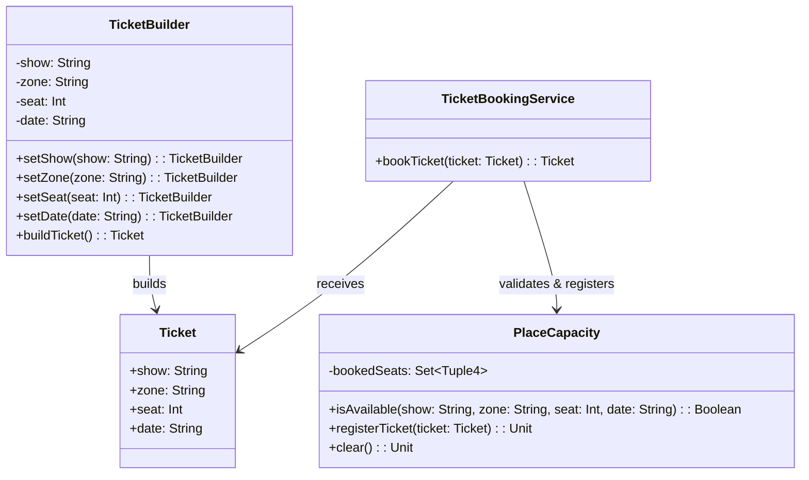

# **Ticket Booking**

## Overview

Ticket booking system demonstrating the **Builder Pattern** for constructing tickets with configurable zones, seats, dates, and shows, while enforcing maximum place capacity and preventing overbooking.

---

## Tech Stack

- **Kotlin 2.2.20** → Modern JVM language with concise syntax and null safety.
- **Gradle** → Build automation tool with Kotlin DSL support.
- **JDK 25** → Required to run the application.
- **kotlin.test** → Testing framework.

---

## Architecture Diagram



---

## Setup Instructions

### 1 - Clone the Repository
```bash
git clone https://github.com/rbleggi/tech-pocs.git
cd kotlin/ticket-booking
```

### 2 - Compile & Run the Application
```bash
./gradlew run
```

### 3 - Run Tests
```bash
./gradlew test
```
