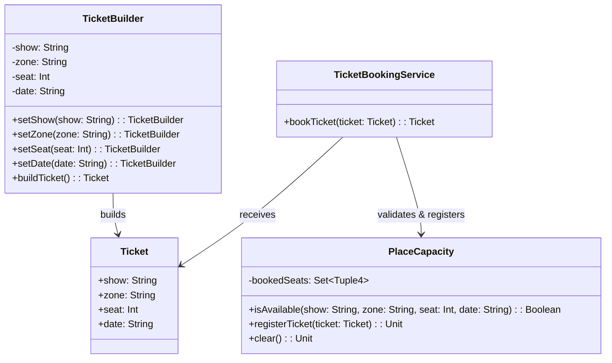

# **Ticket Booking (Kotlin)**

## Overview

This project implements a flexible and safe ticket booking system in Kotlin. Users can choose zones, dates, seats, and shows, while the system enforces maximum place capacity and prevents overbooking.

---

## Tech Stack

- **Kotlin** → Modern JVM-based language with concise syntax and strong type safety.
- **Gradle** → Build automation tool for Kotlin projects.
- **JDK 25** → Required to run the application.

---

## Architecture Diagram



---

## Setup Instructions

### 1 - Clone the Repository

```bash
git clone https://github.com/rbleggi/tech-pocs.git
cd kotlin/ticket-booking
```

### 2 - Compile & Run the Application

```bash
./gradlew build run
```

### 3 - Run Tests

```bash
./gradlew test
```