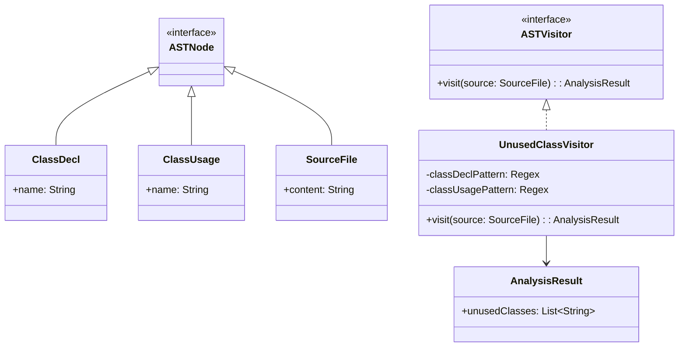

# Unused Class Detector

## Overview

This project detects unused Kotlin classes in source files. The program reads the file, analyzes class declarations and usages, and prints unused classes to the console using the **Visitor Pattern** for AST traversal.

## Features

- **Visitor Pattern** → Analysis is performed by a visitor (UnusedClassVisitor) traversing a simplified AST
- **Class Declaration Detection** → Identifies all class declarations in source files
- **Usage Tracking** → Tracks instantiations using regex-based pattern matching
- **Simple Reporting** → Console output listing unused classes
- **Minimal Interface** → Just run the program to get results

---

## Architecture Diagram



---

## Visitor Pattern

The **Visitor Pattern** allows defining operations to be performed on elements of an object structure without changing the classes of the elements. In this project:

- The `UnusedClassVisitor` implements the analysis logic by traversing the simplified AST
- The visitor analyzes class declarations and usages using regex patterns
- New visitors can be added to perform different types of analysis without modifying existing code

---

## Setup Instructions

1. **Clone the Repository**:
   ```bash
   git clone https://github.com/rbleggi/tech-pocs.git
   cd kotlin/unused-class-detector
   ```

2. **Compiling & Running**:
   ```bash
   ./gradlew build run
   ```

3. **Tests**:
   ```bash
   ./gradlew test
   ```
