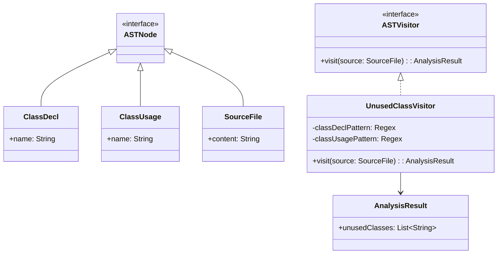

# **Unused Class Detector (Kotlin)**

## Overview

This project detects unused Kotlin classes in source files. The program reads the file, analyzes class declarations and usages, and prints unused classes to the console.

---

## Tech Stack

- **Kotlin** → Modern JVM-based language with concise syntax and strong type safety.
- **Gradle** → Build tool for Kotlin projects.
- **JDK 25** → Required to run the application.

---

## Architecture Diagram


```mermaid
classDiagram
    direction TB

    class ASTNode {
        <<interface>>
    }

    class ClassDecl {
        +name: String
    }

    class ClassUsage {
        +name: String
    }

    class SourceFile {
        +content: String
    }

    class ASTVisitor {
        <<interface>>
        +visit(source: SourceFile): AnalysisResult
    }

    class UnusedClassVisitor {
        -classDeclPattern: Regex
        -classUsagePattern: Regex
        +visit(source: SourceFile): AnalysisResult
    }

    class AnalysisResult {
        +unusedClasses: List~String~
    }

    ASTNode <|-- ClassDecl
    ASTNode <|-- ClassUsage
    ASTNode <|-- SourceFile
    ASTVisitor <|.. UnusedClassVisitor
    UnusedClassVisitor --> AnalysisResult
```

---

## Setup Instructions

### 1 - Clone the Repository

```bash
git clone https://github.com/rbleggi/tech-pocs.git
cd kotlin/unused-class-detector
```

### 2 - Compile & Run the Application

```bash
./gradlew build run
```

### 3 - Run Tests

```bash
./gradlew test
```
