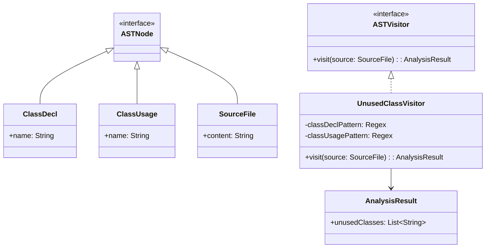

# **Unused Class Detector**

## Overview

Unused class detection tool demonstrating the **Visitor Pattern** for AST traversal, analyzing Kotlin source files to identify class declarations that are never instantiated.

---

## Tech Stack

- **Kotlin 2.2.20** → Modern JVM language with concise syntax and null safety.
- **Gradle** → Build automation tool with Kotlin DSL support.
- **JDK 25** → Required to run the application.
- **kotlin.test** → Testing framework.

---

## Architecture Diagram


```mermaid
classDiagram
    direction TB

    class ASTNode {
        <<interface>>
    }

    class ClassDecl {
        +name: String
    }

    class ClassUsage {
        +name: String
    }

    class SourceFile {
        +content: String
    }

    class ASTVisitor {
        <<interface>>
        +visit(source: SourceFile): AnalysisResult
    }

    class UnusedClassVisitor {
        -classDeclPattern: Regex
        -classUsagePattern: Regex
        +visit(source: SourceFile): AnalysisResult
    }

    class AnalysisResult {
        +unusedClasses: List~String~
    }

    ASTNode <|-- ClassDecl
    ASTNode <|-- ClassUsage
    ASTNode <|-- SourceFile
    ASTVisitor <|.. UnusedClassVisitor
    UnusedClassVisitor --> AnalysisResult
```

---

## Setup Instructions

### 1 - Clone the Repository
```bash
git clone https://github.com/rbleggi/tech-pocs.git
cd kotlin/unused-class-detector
```

### 2 - Compile & Run the Application
```bash
./gradlew run
```

### 3 - Run Tests
```bash
./gradlew test
```
