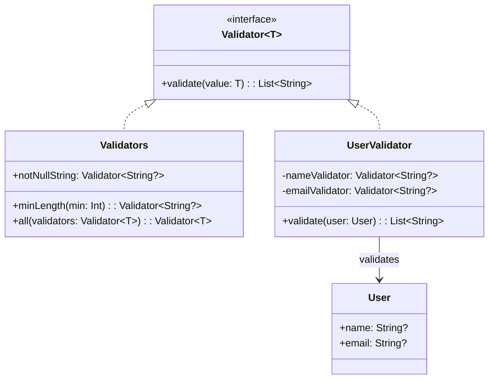

# **Validation Framework (Kotlin)**

## Overview

Extensible validation framework demonstrating the **Strategy Pattern** with composable validators for data class field validation in Kotlin.

---

## Tech Stack

- **Kotlin 2.2.20** → Modern JVM language with concise syntax and null safety
- **Gradle** → Build automation tool
- **JDK 25** → Required to run the application
- **kotlin.test** → Testing framework

---

## Architecture Diagram



---

## Setup Instructions

### 1 - Clone the Repository
```bash
git clone https://github.com/rbleggi/tech-pocs.git
cd kotlin/validation-framework
```

### 2 - Build the Project
```bash
./gradlew build
```

### 3 - Run the Application
```bash
./gradlew run
```

### 4 - Run Tests
```bash
./gradlew test
```
