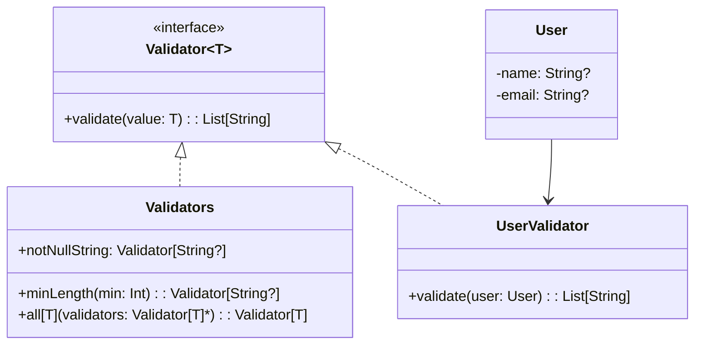

# **Validation Framework (Kotlin)**

## Overview

This project implements a simple and extensible validation framework in Kotlin. It allows developers to define reusable validators and compose them to validate data class fields.

---

## Tech Stack

- **Kotlin** → Modern JVM-based language with advanced type safety and functional programming features.
- **Gradle** → Kotlin's official build tool.
- **JDK 25** → Required to run the application.

---

## Architecture Diagram


```mermaid
classDiagram
    direction TB

    class Validator~T~ {
        <<interface>>
        +validate(value: T): List[String]
    }

    class User {
        -name: String?
        -email: String?
    }

    class Validators {
        +notNullString: Validator[String?]
        +minLength(min: Int): Validator[String?]
        +all[T](validators: Validator[T]*): Validator[T]
    }

    class UserValidator {
        +validate(user: User): List[String]
    }

    Validator~T~ <|.. Validators
    Validator~T~ <|.. UserValidator
    User --> UserValidator
```

---

## Setup Instructions

### 1 - Clone the Repository

```bash
git clone https://github.com/rbleggi/tech-pocs.git
cd kotlin/validation-framework
```

### 2 - Compile & Run the Application

```bash
./gradlew build run
```

### 3 - Run Tests

```bash
./gradlew test
```
