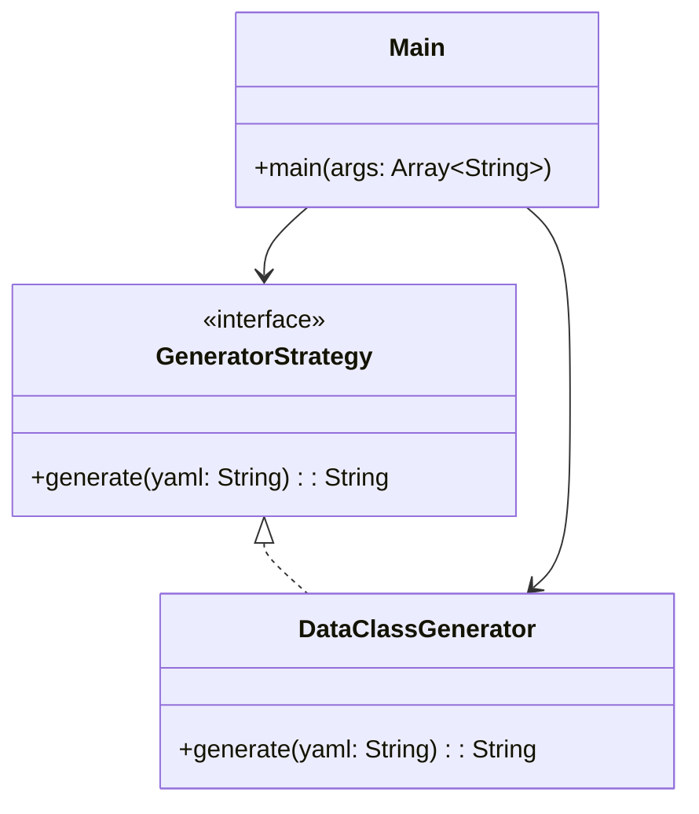

# YAML Code Generator

## Overview

A **code generation framework** that converts YAML definitions into Kotlin data classes. It uses the **Strategy Pattern** to enable flexible code generation strategies, making it easy to extend for different target languages or code styles.

---

## Tech Stack

- **Kotlin** → Modern JVM-based language with concise syntax and type safety.
- **Gradle** → Build tool with Kotlin DSL support.
- **JDK 21** → Required to run the application.

---

## Features

- **YAML Parsing** → Reads simple YAML definitions for class structures
- **Strategy Pattern** → Pluggable generation strategies for different output formats
- **Data Class Generation** → Generates Kotlin data classes from YAML definitions
- **Type-Safe** → Preserves type information from YAML to generated code
- **Single File POC** → Complete implementation in a single file for simplicity

---

## Architecture Diagram



### Explanation
- **GeneratorStrategy** → Interface defining the contract for code generation strategies
- **DataClassGenerator** → Implements the strategy to generate Kotlin data classes
- **Main** → Entry point that uses the strategy to generate code from YAML

---

## Strategy Pattern

The **Strategy Pattern** allows different code generation algorithms to be selected at runtime. Each strategy implements the `GeneratorStrategy` interface, enabling easy extension for new target languages or code formats.

Key benefits:
- **Extensibility**: New generation strategies can be added without modifying existing code
- **Separation of Concerns**: Generation logic is isolated in dedicated strategy classes
- **Flexibility**: Different strategies can be swapped at runtime

---

## Usage Examples

### Input YAML
```yaml
Person:
  name: String
  age: Int
  address: Address
  phones: List<String>

Address:
  street: String
  number: Int
  city: String
  state: String
```

### Generated Output
```kotlin
data class Person(
  val name: String,
  val age: Int,
  val address: Address,
  val phones: List<String>
)
```

---

## Setup Instructions

### 1️ - Clone the Repository

```bash
git clone https://github.com/rbleggi/tech-pocs.git
cd kotlin/yaml-code-generator
```

### 2️ - Compile & Run the Application

```shell
./gradlew run
```

### 3️ - Build JAR

```shell
./gradlew jar
```

### 4️ - Run Tests

```shell
./gradlew test
```

---

## Implementation Details

### GeneratorStrategy Interface
```kotlin
interface GeneratorStrategy {
    fun generate(yaml: String): String
}
```

### DataClassGenerator
Parses YAML format:
- First line: Class name
- Subsequent lines: Field definitions with types

Example:
```yaml
Person:
  name: String
  age: Int
```

Generates:
```kotlin
data class Person(
  val name: String,
  val age: Int
)
```

---

## Project Structure

```
yaml-code-generator/
├── src/
│   ├── main/kotlin/com/rbleggi/yamlcodegenerator/
│   │   └── Main.kt                     # Strategy interface and implementation
│   └── test/kotlin/com/rbleggi/yamlcodegenerator/
│       └── YamlCodeGeneratorTest.kt    # Test suite
├── build.gradle.kts                    # Build configuration
└── README.md                           # This file
```