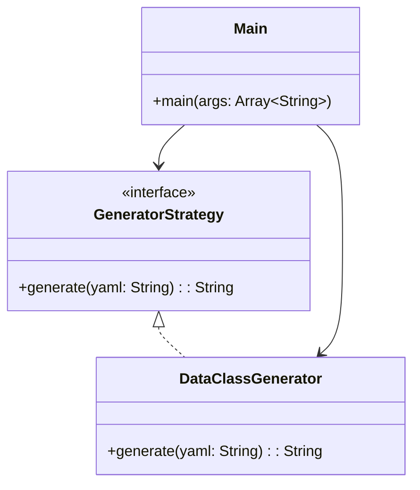

# **YAML Code Generator (Kotlin)**

## Overview

A code generation framework that converts YAML definitions into Kotlin data classes. It enables flexible code generation strategies, making it easy to extend for different target languages or code styles.

---

## Tech Stack

- **Kotlin** → Modern JVM-based language with concise syntax and type safety.
- **Gradle** → Build tool with Kotlin DSL support.
- **JDK 25** → Required to run the application.

---

## Architecture Diagram


```mermaid
classDiagram
    class GeneratorStrategy {
        <<interface>>
        +generate(yaml: String): String
    }

    class DataClassGenerator {
        +generate(yaml: String): String
    }

    class Main {
        +main(args: Array~String~)
    }

    GeneratorStrategy <|.. DataClassGenerator
    Main --> GeneratorStrategy
    Main --> DataClassGenerator
```

---

## Setup Instructions

### 1 - Clone the Repository

```bash
git clone https://github.com/rbleggi/tech-pocs.git
cd kotlin/yaml-code-generator
```

### 2 - Compile & Run the Application

```bash
./gradlew build run
```

### 3 - Run Tests

```bash
./gradlew test
```