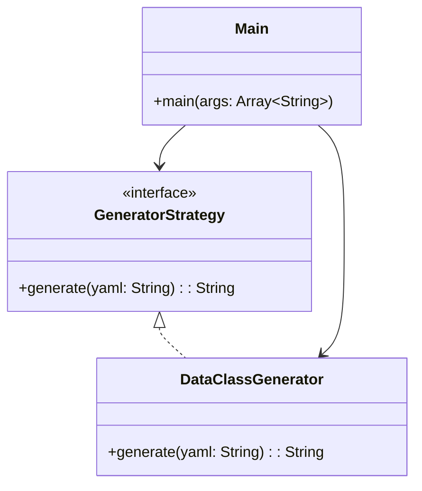

# **YAML Code Generator**

## Overview

Code generation framework demonstrating the **Strategy Pattern** for converting YAML definitions into Kotlin data classes, with pluggable generation strategies to support multiple output formats.

---

## Tech Stack

- **Kotlin 2.2.20** → Modern JVM language with concise syntax and null safety.
- **Gradle** → Build automation tool with Kotlin DSL support.
- **JDK 25** → Required to run the application.
- **kotlin.test** → Testing framework.

---

## Architecture Diagram


```mermaid
classDiagram
    class GeneratorStrategy {
        <<interface>>
        +generate(yaml: String): String
    }

    class DataClassGenerator {
        +generate(yaml: String): String
    }

    class Main {
        +main(args: Array~String~)
    }

    GeneratorStrategy <|.. DataClassGenerator
    Main --> GeneratorStrategy
    Main --> DataClassGenerator
```

---

## Setup Instructions

### 1 - Clone the Repository
```bash
git clone https://github.com/rbleggi/tech-pocs.git
cd kotlin/yaml-code-generator
```

### 2 - Build the Project
```bash
./gradlew build
```

### 3 - Run Tests
```bash
./gradlew test
```
