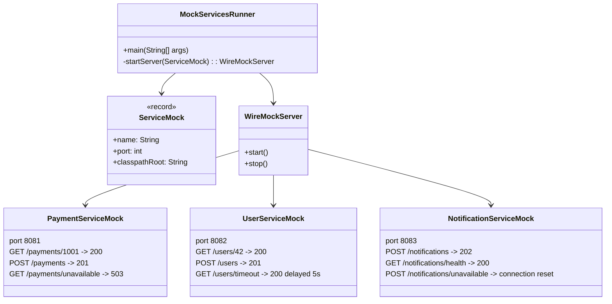

# **WireMock Mock Services**

## Overview

A standalone WireMock setup that simulates 3 downstream services (payment-service, user-service, notification-service) on separate ports. Each service has its own stub mappings, including success responses, delayed responses, and failure scenarios. The mocks can be started independently of the test suite, useful when a real dependency is not yet implemented or is failing in an environment. The same stub mappings are also exercised through Testcontainers, running each service as the official WireMock Docker image instead of an in-process server.

---

## Tech Stack

- **Java 25** -> Modern Java with records and streams.
- **WireMock 3** -> HTTP mocking library, run both standalone and in tests.
- **Testcontainers** -> Runs the WireMock Docker image per service for container-based tests.
- **JUnit 5** -> Test framework, verifies each service's stub mappings.
- **Gradle** -> Build tool.

---

## Architecture Diagram



---

## Setup Instructions

### 1 - Clone the Repository

```bash
git clone https://github.com/rbleggi/tech-pocs.git
cd personal/java/wiremock-mock-services
```

### 2 - Start the Mock Services Standalone

```bash
./gradlew run
```

This starts all 3 services and keeps them running until `Ctrl+C`:

```
payment-service mock running at http://localhost:8081
user-service mock running at http://localhost:8082
notification-service mock running at http://localhost:8083
```

Point your application at these URLs to simulate a dependency that is not ready yet or is failing:

```bash
curl http://localhost:8081/payments/1001
curl http://localhost:8082/users/42
curl -X POST http://localhost:8083/notifications
```

### 3 - Run Tests

```bash
./gradlew test
```

`MockServicesRunnerTest` starts each service as an in-process `WireMockServer`. `MockServicesContainerTest` starts each service as the `wiremock/wiremock` Docker image via Testcontainers, mounting the same mappings folder; it requires a running Docker daemon.
