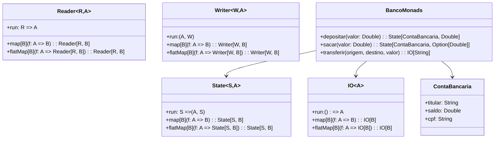

# **Advanced Monads**

## Overview

This project demonstrates advanced monads in Scala 3 including IO, State, Reader, and Writer monads. These monads are used to manage side effects, stateful computations, environment dependencies, and logging in a purely functional way. The example uses Brazilian banking operations to illustrate practical applications.

---

## Tech Stack

- **Language** -> Scala 3.6.3
- **Build Tool** -> sbt 1.10.11
- **Runtime** -> JDK 25
- **Testing** -> ScalaTest 3.2.16

---

## Architecture Diagram



---

## Setup Instructions

### 1 - Clone

```bash
git clone https://github.com/rbleggi/tech-pocs.git
cd scala-3/advanced-monads
```

### 2 - Build

```bash
sbt compile
```

### 3 - Test

```bash
sbt test
```
