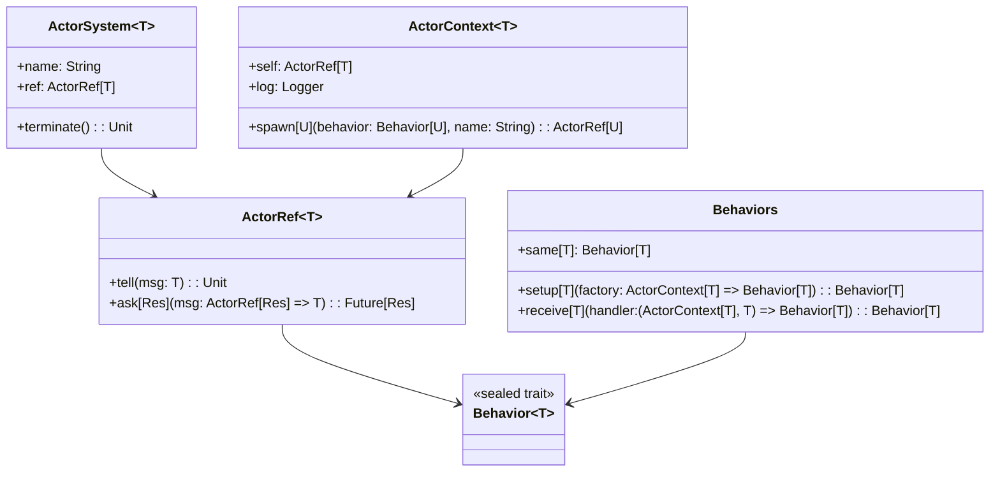

# **Apache Pekko Deep Dive**

## Overview

A deep-dive into Apache Pekko's typed actor model in Scala 3. Demonstrates actor creation, message passing, supervision, and lifecycle management using the Actor Pattern as a foundation for building concurrent and distributed systems.

---

## Tech Stack

- **Language** -> Scala 3
- **Build Tool** -> sbt
- **Testing** -> ScalaTest 3.2.16
- **JDK** -> 25
- **Apache Pekko** -> Typed actor framework (pekko-actor-typed 1.0.2)

---

## Architecture Diagram



---

## Setup Instructions

### 1 - Clone

```bash
git clone https://github.com/rbleggi/tech-pocs.git
cd scala-3/apache-pekko-deep-dive
```

### 2 - Build

```bash
sbt compile
```

### 3 - Test

```bash
sbt test
```
