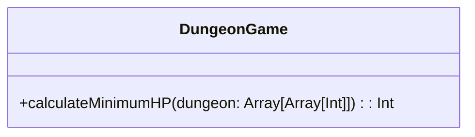

# **Dungeon Game**

## Overview

This project calculates the minimum initial health required for a knight to rescue a princess in a dungeon.

---

## Tech Stack

- **Scala 3** → Modern JVM-based language with advanced type safety and functional programming features.
- **SBT** → Scala's official build tool.
- **JDK 25** → Required to run the application.

---

## Architecture Diagram



---

## Setup Instructions

### 1 - Clone the Repository

```bash
git clone https://github.com/rbleggi/tech-pocs.git
cd scala-3/dungeon-game
```

### 2 - Compile & Run the Application

```bash
sbt compile run
```

### 3 - Run Tests

```bash
sbt test
```